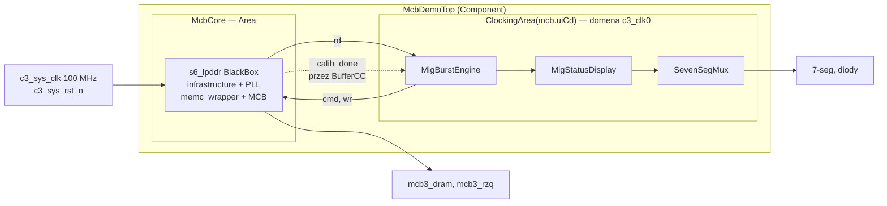

# MCB LPDDR w SpinalHDL — Spartan-6 / Mimas V2

Kontroler pamięci LPDDR oparty na twardym bloku MCB, opakowany w SpinalHDL.
Dokument łączy instrukcję użycia z zapisem tego, co wyszło w trakcie
doprowadzania tego do działania — bo połowa wiedzy tutaj to rzeczy, których
nie ma w dokumentacji albo są w niej w nieoczywistym miejscu.

**Stan:** działa, zmierzone, zamknięte na 643,8 MB/s (96,5% szczytu pamięci).

---

## 1. Sprzęt i konfiguracja

| | |
|---|---|
| Płytka | Numato Mimas V2 |
| FPGA | Spartan-6 XC6SLX9, CSG324, speed grade -3 |
| Pamięć | Micron MT46H32M16 — 512 Mb LPDDR, x16, 64 MB |
| Generator | MIG 3.61 (CORE Generator 12.4) |
| Oscylator | 100 MHz |
| Geometria | 13 bitów wiersza, 2 banku, 10 kolumny → wiersz 2 kB |

Konfiguracja docelowa: **port 128-bitowy (Config-5), zegar pamięci 166,67 MHz**.

---

## 2. Szybki start

```scala
class MyTop extends Component {
  val io = new Bundle {
    val c3_sys_clk   = in Bool()
    val c3_sys_rst_n = in Bool()          // aktywny WYSOKI, patrz §5.1
    val mcb3_dram    = MigDramPins(cfg)   // nazwa pola = prefiks portów!
    val mcb3_rzq     = inout(Analog(Bool()))
  }
  noIoPrefix()

  val cfg = MigConfig(dataWidth = 128, memClkPeriod = 6000)
  val mcb = McbCore(cfg, io.c3_sys_clk, io.c3_sys_rst_n, io.mcb3_dram, io.mcb3_rzq)

  val logic = new ClockingArea(mcb.uiCd) {     // zegar UI wychodzi Z MCB
    val master = MyMemoryMaster(cfg)
    mcb.port.driveFrom(master.io.port)
    master.io.calib := BufferCC(mcb.calibDone, False)
  }
}
```

Generowanie: `sbt "runMain mig.McbDemoTopVerilog bench128"` → `rtl/bench128/McbDemoTop.v`.

---

## 3. Pliki

| Plik | Rola |
|---|---|
| `MigPort.scala` | `MigConfig` + bundle `MigCmd` / `MigWrData` / `MigPort` |
| `S6Lpddr.scala` | BlackBox wygenerowanego core'a + mapowanie na `Stream` |
| `McbCore.scala` | `MigDramPins` + `Area` chowająca całe okablowanie |
| `MigBurstEngine.scala` | Master portu: benchmark i test regresyjny |
| `MigStatusDisplay.scala` | Liczniki BCD + status na 3 × 7-seg |
| `McbDemoTop.scala` | Top płytki + tryby generowania |

Po stronie Verilogu potrzebne jest **dziewięć** plików z `user_design/`:
`s6_lpddr.v`, `infrastructure.v` oraz z podkatalogu `mcb_controller/`:
`memc_wrapper.v`, `mcb_ui_top.v`, `mcb_raw_wrapper.v`, `mcb_soft_calibration.v`,
`mcb_soft_calibration_top.v`, `iodrp_controller.v`, `iodrp_mcb_controller.v`.

---

## 3a. Architektura



### Domeny zegarowe

| Zegar | Wartość | Gdzie trafia |
|---|---|---|
| `c3_sys_clk` | 100 MHz | **tylko** do PLL wewnątrz blackboxa |
| `sysclk_2x` | 2 × memclk | przez `BUFPLL_MCB` do twardego bloku MCB |
| `mcb_drp_clk` | memclk/2 | soft-kalibracja |
| `c3_clk0` | memclk/4 | **domena logiki użytkownika** |

`c3_sys_clk` nie taktuje ani jednego rejestru twojego projektu. Dlatego
`ClockingArea` zostało w API celowo widoczne — pierwszy rejestr dołożony poza
tą domeną trafiłby na zegar systemowy i dałby przejście międzydomenowe bez
synchronizacji.

`sysclk_2x` nie dociera do logiki programowalnej, stąd zero analizowanych
ścieżek w jego domenie w raporcie czasowym, mimo 333 MHz przy memclk 166 MHz.

### Przejścia międzydomenowe

Są dwa. Pierwsze robią kolejki portu — `cmd_clk`, `wr_clk` i `rd_clk` to
niezależne wejścia, więc MCB załatwia CDC sprzętowo. Drugie to `calib_done`
z domeny `mcb_drp_clk`, przechodzące przez `BufferCC`.

---

## 4. API

### MigConfig

Jedno miejsce na wszystkie liczby zależne od tego, co wygenerował MIG.
Pojemność pamięci **liczy się z geometrii**, nie jest wpisywana — dzięki temu
niezgodność między generikami a rzeczywistą kością wychodzi przy elaboracji,
a nie po cichu jako aliasowanie adresów.

```scala
MigConfig(dataWidth = 128, memClkPeriod = 6000)
  .uiClkHz              // memClkHz / uiClkDivider
  .portPeakBytesPerSec  // sufit portu użytkownika
  .dramPeakBytesPerSec  // szczyt pamięci
  .rowBytes             // 2048
  .memBytes             // z geometrii
```

### MigPort

Kolejki MCB mają semantykę `Stream` jeden do jednego, więc warstwa jest cienka:

```
cmd.ready = !cmd_full    cmd_en = cmd.fire
wr.ready  = !wr_full     wr_en  = wr.fire
rd.valid  = !rd_empty    rd_en  = rd.fire     (FIFO jest FWFT)
```

Co **musi** zapewnić master — szczegóły w §6.

### McbCore

`Area`, nie `Component`. Dzięki temu sygnały `Analog` nie przechodzą przez
granicę modułu, netlista nie dostaje zbędnego poziomu hierarchii, a domena
zegarowa oddana przez MCB działa bez sztuczek.

---

## 5. Pułapki, które kosztowały czas

### 5.1 Reset jest aktywny wysokim

MIG wygenerował `C3_RST_ACT_LOW = 0`, więc port **nazwany** `c3_sys_rst_n`
resetuje stanem **wysokim**. Widać to w `infrastructure.v`:

```verilog
assign sys_rst = C_RST_ACT_LOW ? ~sys_rst_n : sys_rst_n;
```

### 5.2 Zegar UI to memclk/4, nie memclk/2

`CLKOUT2_DIVIDE = 16` przy `CLKOUT0_DIVIDE = 2` daje `c3_clk0 = memclk/4`,
a `CLKOUT3_DIVIDE = 8` daje `mcb_drp_clk = memclk/2`. **CLKOUT2 to zegar
użytkownika, CLKOUT3 to zegar kalibracji** — łatwo pomylić kolejność.

Konsekwencja: port 32-bitowy z definicji bierze ćwiartkę przepustowości
pamięci. Stosunek 4:1 jest zaprojektowany tak, żeby port **128-bitowy**
wysycał pamięć dokładnie.

Weryfikacja: wyprowadzone ograniczenia w `.twr` podają rzeczywisty okres
`c3_clk0`. To wiarygodne źródło, bo liczone z netlisty.

### 5.3 MIG zakłada, że zegar wejściowy = zegar pamięci

W kreatorze **nie ma** ustawienia okresu zegara wejściowego. Wzór w
`s6_lpddr.v` przy domyślnych dzielnikach upraszcza się do `INCLK = MEMCLK`:

```verilog
localparam C3_INCLK_PERIOD = ((C3_MEMCLK_PERIOD * C3_CLKFBOUT_MULT)
                              / (C3_DIVCLK_DIVIDE * C3_CLKOUT0_DIVIDE * 2));
```

Żeby użyć oscylatora 100 MHz z szybszą pamięcią, trzeba **ręcznie poprawić
dwa `localparam`** w `s6_lpddr.v` (UG388, „Modifying the Clock Setup"):

| memclk | MULT | DIVCLK | VCO | PFD | zegar UI |
|---|---|---|---|---|---|
| 100 MHz | 4 | 1 | 400 MHz | 100 MHz | 25,00 MHz |
| 125 MHz | 5 | 1 | 500 MHz | 100 MHz | 31,25 MHz |
| 150 MHz | 6 | 1 | 600 MHz | 100 MHz | 37,50 MHz |
| 166,7 MHz | 20 | 3 | 666,7 MHz | 33,3 MHz | 41,67 MHz |

`C3_INCLK_PERIOD` poprawi się samo — to wyrażenie. Sprawdź, że wychodzi 10000.

**Ta edycja ginie przy każdej regeneracji z MIG.** Trzymaj ją jako patch.

Gdyby to nie zadziałało: przy 166 MHz PFD spada do 33 MHz, co oznacza wyższy
jitter na wyjściu PLL niż w wariantach z PFD 100 MHz.

### 5.4 XST nie szuka modułów po katalogach

Każdy z dziewięciu plików musi być dodany do projektu jako źródło. Objaw:
`Instantiating <memc3_infrastructure_inst> from unknown module <infrastructure>`.

Dodatkowo `example_design/rtl/` ma **własne kopie** `infrastructure.v`
i `memc_wrapper.v` o tych samych nazwach modułów — trzymaj jeden zestaw.

### 5.5 LOC-i pamięci są narzucone przez krzem

MCB jest na sztywno przylutowany do konkretnych pinów w banku 3, więc
`mcb3_dram_*` muszą być identyczne w UCF MIG-a i UCF płytki. Board-specific
są tylko `c3_sys_clk`, `c3_sys_rst_n` i twoje diody.

### 5.6 Bez ograniczeń czasowych raport nic nie znaczy

Sam UCF płytki nie ma `TIMESPEC`, więc `.twr` kończy się na
`No timing constraints found` i **nie sprawdza niczego**. Przenieś z
`s6_lpddr.ucf`:

```
CONFIG MCB_PERFORMANCE = STANDARD;

NET "*/memc3_infrastructure_inst/sys_clk_ibufg" TNM_NET = "SYS_CLK3";
TIMESPEC "TS_SYS_CLK3" = PERIOD "SYS_CLK3"  10  ns HIGH 50 %;

NET "*/c?_pll_lock" TIG;
NET "*/memc?_wrapper_inst/mcb_ui_top_inst/mcb_raw_wrapper_inst/selfrefresh_mcb_mode" TIG;
```

Wildcard `*/` zamiast sztywnej nazwy instancji przeżyje przemianowanie
`val mcb` w Scali. Ograniczenie celuje w sieć **za** `IBUFG` — ma tam
atrybut `KEEP` właśnie po to.

Jeden `TIMESPEC` na wejściu wystarczy: ISE sam wyprowadza ograniczenia dla
wyjść PLL. **Błędna ścieżka nie daje błędu**, tylko ciche ostrzeżenie —
sprawdź, czy w `.twr` pojawiła się sekcja `TS_SYS_CLK3`.

Nie kopiuj `IOSTANDARD` ani `LOC` (duplikaty = konflikt). `CONFIG VCCAUX`
zależy od płytki. `MCB_PERFORMANCE = EXTENDED` **nie pomoże** — ten tryb
wprowadzono dla DDR2, wydajność LPDDR jest niezmieniona.

### 5.7 ROW_BANK_COLUMN to właściwy wybór

Bity banku nad kolumną oznaczają, że przekroczenie granicy 2 kB przechodzi do
**następnego banku**, nie do następnego wiersza. MCB trzyma kilka banków
otwartych i chowa aktywację. Potwierdzone pomiarem: sprawność nie spada
z częstotliwością (§7).

### 5.8 Pułapki SpinalHDL

- `import spinal.lib._` wciąga `spinal.lib.math`, które **przesłania
  `scala.math`**. `min`, `max`, `ceil` wymagają `scala.math.` z przodu.
- `val wait = ...` się nie skompiluje — `Object.wait()` jest `final`.
- Próg porównania szerszy niż operand → `OUT OF RANGE CONSTANT`. To nie jest
  upierdliwość, tylko wykrycie martwego warunku.
- `StateMachine` dokłada stan `BOOT`: siedem zadeklarowanych → osiem w raporcie.
- Nazwa pola bundla daje prefiks portów. `val mcb3_dram = MigDramPins(c)` →
  `mcb3_dram_dq`. Przemianowanie zepsuje wszystkie LOC-i naraz.

---

## 6. Kontrakt MCB

Rzeczy, o których musi pamiętać każdy master portu.

**Długość burstu** — pole `cmd_bl` to długość **minus jeden**. Zakres 1–64 słów.

**Maska zapisu** jest aktywna wysokim: bit = 1 oznacza bajt **pominięty**.

**Zapis wymaga danych przed komendą.** Silnik wystawia `WRITE` dla burstu *k*
dopiero gdy `pushIdx >= (k+1)*burstLen`. Bez tego MCB zgłasza `wr_underrun`
i zapisuje śmieci.

**Nie ufaj `wr_count`.** Ma dłuższe opóźnienie niż flagi; nadaje się tylko na
znacznik „prawie pełne". UG388 wprost mówi, żeby do zapobiegania underrunowi
użyć innych metod. Silnik używa własnego licznika wypchniętych słów.

**Kolejka odczytu musi mieć miejsce** na cały burst w chwili wykonania komendy,
inaczej `rd_overflow`. Dławik: `inFlight <= fifoDepth - burstLen`.

**Głębokości kolejek:** komend 4, danych 64 słowa. Przy `BL = 64` jeden burst
wypełnia całe FIFO i znika nakładanie — najdłuższy burst nie jest najszybszy.

**`rd_en` można trzymać stale wysoko**, `rd_empty` służy jako wskaźnik
poprawności danych. Tak działa warstwa `Stream`.

**Dane odczytu wracają w kolejności komend i bez tagu.** Zapis nie ma
potwierdzenia — o uporządkowaniu decyduje wyłącznie kolejność komend na tym
samym porcie.

**Wyrównanie adresu** zależy od szerokości portu: 32 b → `addr[1:0] = 0`,
128 b → `addr[3:0] = 0`.

**`wr_error` / `rd_error` to rozjechane wskaźniki kolejki**, nie zwykłe
przepełnienie. Wyjście z tego stanu wymaga **resetu MCB**. To poważniejsza
awaria niż `wr_underrun` czy `rd_overflow`.

**Zegary `cmd_clk` / `wr_clk` / `rd_clk` są niezależne** — kolejki robią CDC.

**Więcej portów nie daje przepustowości.** Dzielą te same 400–667 MB/s,
a arbiter dokłada narzut. Są po to, żeby obsłużyć niezależnych klientów.

---

## 7. Wyniki pomiarów

Metodyka: silnik zapisuje region, odczytuje go i porównuje, w pętli. Na każdej
szerokości portu na przebieg przypada dokładnie 1 MiB, więc odczyt
z wyświetlacza to wprost MiB/s i konfiguracje są porównywalne.

| Port | memclk | zegar UI | odczyt | MB/s | sufit | sprawność |
|---|---|---|---|---|---|---|
| 32 b | 100 MHz | 25,00 MHz | 95 | 100,0 | 100 | 99,9% |
| 128 b | 100 MHz | 25,00 MHz | 368 | 385,9 | 400,0 | 96,5% |
| 128 b | 125 MHz | 31,25 MHz | 460 | 482,3 | 500,0 | 96,5% |
| 128 b | 150 MHz | 37,50 MHz | 552 | 578,8 | 600,0 | 96,5% |
| 128 b | 166,7 MHz | 41,67 MHz | 614 | 643,8 | 666,7 | 96,6% |

**Łącznie 6,4× od punktu wyjścia.**

Trzy wnioski, które wyszły z liczb:

Przy 32 bitach port jest wysycony w 99,9% — warstwa `Stream` z burstami nie
wnosi mierzalnego narzutu. Bursty dłuższe niż 32 nie miały czego odzyskać.

Skalowanie z częstotliwością jest **idealnie liniowe**, a sprawność stała co do
drugiego miejsca po przecinku. Gdyby brakujące 3,5% brało się z zarządzania
wierszami, sprawność by spadała — `tRCD` i `tRP` to stałe czasy, więc w taktach
rosną. Skoro nie spada, aktywacja jest w pełni schowana za przeplotem banków.

Odświeżanie tłumaczy około 1% (`tRFC` do `tREFI`). Reszta to narzut
proporcjonalny do liczby taktów. **Hipoteza:** jeden takt przerwy na burst,
co przy `BL = 32` daje 3,1%. Sprawdzian: `bench128` z `burstLen = 16` —
jeśli sprawność spadnie do ~93,8%, hipoteza się broni.

### Timing i zasoby (stan z konfiguracji 32 b / 100 MHz)

Wszystkie ograniczenia spełnione, score 0, 14 532 ścieżki. Domena `c3_clk0`:
osiągnięte 6,823 ns przy wymaganych 40 ns. Domena `mcb_drp_clk`: 6,798 ns przy
20 ns. Ścieżka krytyczna prowadzi z twardego bloku MCB do logiki użytkownika.

Fabric zamyka się na ~146 MHz, więc zegar UI nigdy nie był wąskim gardłem.
Przy 166 MHz zapas na `mcb_drp_clk` spada do ~1,8× — to najciaśniejszy punkt
projektu.

Zasoby: 277 przerzutników i 454 LUT-y (2% i 7% LX9), z czego logika testu
to ~42 przerzutniki. Reszta to MCB i soft-kalibracja i nie rośnie.

---

## 8. Diagnostyka

### Wyświetlacz

| Wyświetlacz | Znaczenie |
|---|---|
| `- - -` | przed kalibracją |
| `E E n` | błąd MCB: 1 `wr_underrun`, 2 `wr_error`, 3 `rd_overflow`, 4 `rd_error` |
| liczba **z kropkami** | indeks pierwszej niezgodności, dziesiętnie |
| liczba **bez kropek** | MiB/s |

Kropki są znacznikiem trybu, bo tablica segmentów ma tylko cyfry, blank, minus
i `E` — marnowanie pozycji na prefiks przy trzech cyfrach byłoby kosztowne.
Liczniki BCD zamiast konwersji binarnej: zero dzielenia, wartość idzie na
7-seg wprost.

Licznik ma **trzy cyfry i przewija się po 999** bez ostrzeżenia.

### Tryby generowania

| Tryb | Co sprawdza |
|---|---|
| `diag1` | zero potokowania, ścisły zapis — zachowanie referencyjne |
| `diag2` | + potokowanie odczytu |
| `diag3` | + zapis z wyprzedzeniem |
| `regress32` / `regress128` | krok 2 kB przez banki i wiersze + 200 ms na odświeżanie |
| `bench32` / `bench128` | pomiar przepustowości |

Bisekcja `diag1..3` zmienia dokładnie jeden element naraz i zatrzymuje się po
jednym przebiegu, żeby późniejsze przebiegi niczego nie zamaskowały.

**Kontrola negatywna:** parametr `injectFault = true` psuje wzorzec oczekiwany,
więc `data_error` **musi** się zapalić. Test, który zawsze przechodzi, wygląda
identycznie jak test poprawny — warto to sprawdzić raz po każdej większej
zmianie w komparatorze.

---

## 9. Wątki otwarte

**Niewyjaśniona awaria `regress`.** Po refaktorze na `Stream` test zapalił
`test_error`, a po dodaniu diagnostyki przestał — mimo że żadna ze zmian nie
dotykała ścieżki, która mogłaby to naprawić. Najpewniej nieaktualny bitstream,
ale nie zostało to potwierdzone. Błąd, który znika bez zidentyfikowanej
przyczyny, zwykle wraca.

**Brak długiego przebiegu na 166 MHz.** Trasy DDR na płytce Numato walidował
na 100 MHz; 166 MHz to 67% powyżej. Zapas czasowy na `mcb_drp_clk` spadł do
1,8×. Zanim uznać to za produkcyjne, warto zostawić `regress128` na godzinę.
Konfiguracje 125 i 150 MHz są sprawdzone i stanowią punkty odwrotu.

**Hipoteza narzutu na burst** (§7) — jeden build, żeby rozstrzygnąć.

**Auto-precharge.** Silnik używa zwykłych `WRITE`/`READ`. Przy strumieniu
sekwencyjnym każdy wiersz jest odwiedzany raz, więc `WRITE_AP`/`READ_AP` mogłyby
przyspieszyć kolejną aktywację. Kody są już w `MigInstr`, zmiana to dwie stałe.

**Ścieżka AXI.** MIG potrafi wygenerować port z natywnym interfejsem AXI4.
To alternatywa dla warstwy `Stream`, nie jej kontynuacja — wymieniłaby cały
`MigPort`. Sensowna, jeśli celem jest podpięcie do ekosystemu `Axi4`
w SpinalHDL.

**Dwie konfiguracje = dwa projekty ISE.** Podmoduły zawsze nazywają się
`memc_wrapper`, `mcb_ui_top` i tak dalej, niezależnie od konfiguracji, więc
dwa zestawy w jednym projekcie to konflikt redefinicji. Zmiana nazwy komponentu
w MIG zmienia tylko top-level.

---

## 10. Źródła

- **UG388** — *Spartan-6 FPGA Memory Controller*. Rozdział 2: timing interfejsu
  użytkownika, reguły burstów, arbitraż. Sekcja „Modifying the Clock Setup"
  (s. 39 w v2.3) — ręczna zmiana dzielników PLL.
- **UG416** — *Memory Interface Solutions*. Struktura katalogów, generator
  ruchu, przepływ EDK z parametrami AXI, debugowanie.
- **DS162 / DS160** — limity danych MCB, zakresy PLL.
- **Xilinx AR 35818** — `MCB_PERFORMANCE`: tryb `EXTENDED` wprowadzono dla
  DDR2, wydajność DDR3, DDR i LPDDR jest niezmieniona.
