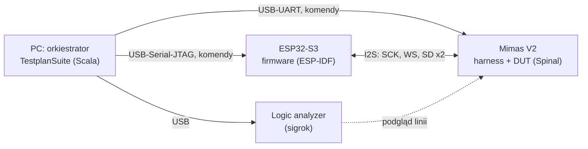

# vertebra-hil: weryfikacja IP na sprzęcie z niezależnym partnerem

Sep 22, 2026 · @Someone

## 1. Cel i założenia

Stanowisko sprawdza IP uruchomione na FPGA **niezależną implementacją tego samego protokołu w krzemie** (ESP32-S3). Uzupełnia symulację vertebry, nie zastępuje jej. Nazwa robocza: `vertebra-hil`.

Po co. Wszystkie dotychczasowe testy (DUT, modele magistrali, monitory, para master–slave) napisał ten sam zespół na podstawie tej samej lektury specyfikacji. Wspólny błąd interpretacji przechodzi przez wszystkie warstwy na zielono. Peryferium ESP32 to druga, niezależna interpretacja, sprawdzona z tysiącami urządzeń.

Do tego efekty, których symulacja nie ma: prawdziwie asynchroniczne zegary i jitter, synchronizator i metastabilność w krzemie, różnice między symulacją a syntezą (wartości początkowe, reset), opóźnienia IO.

Zasady:

- **PC myśli, urządzenia wykonują.** Scenariusze, konfiguracje i ocena wyniku są na PC. ESP32 i FPGA mają mały, stabilny zestaw komend. Nowy scenariusz nie wymaga flashowania ESP32 ani nowego bitstreamu.
- **Precyzja czasowa lokalnie.** Wszystko, co wymaga trafienia w konkretny moment (reset w losowym miejscu ramki), robi urządzenie z seeda. UART służy tylko do sterowania.
- **Samosynchronizujące się dane.** Płytki nie są synchronizowane w czasie; kolejność i poprawność są zakodowane w samych danych (§4).
- **Wyrocznię też się weryfikuje.** ESP32 może się mylić. Spór między ESP32 a FPGA rozstrzyga trzeci świadek: logic analyzer.
- **Harness to też IP.** Przechodzi własny testplan w symulacji, zanim trafi na płytkę.
- **Generyczność tylko prosta.** Wspólne jest to, co nie zna protokołu: transport, komendy, rejestry, liczniki, orkiestracja. Wszystko, co zna protokół, jest per IP. Abstrakcje wydzielamy przy I2C, gdy widać drugi przypadek, a nie wcześniej.
- **Jeden raport.** Testy sprzętowe to testpointy w `TestplanSuite`, z etapami i `unimplemented`, jak w symulacji.

## 2. Zakres (I2S)

Na sprzęcie sprawdzamy zgodność formatu z obcą implementacją i zachowanie przy prawdziwym zegarze. Złośliwe scenariusze, których ESP32 nie potrafi wygenerować, zostają w symulacji.

Testpointy sprzętowe mają prefiks `hw_` i w `checking` odsyłają do testpointu symulacyjnego, który uzupełniają (np. `hw_slv_rx_frame` → `slv_rx_frame`).

| Testpoint symulacyjny | Na sprzęcie | Jak |
| --- | --- | --- |
| `slv_tx_frame`, `slv_rx_frame`, `slv_full_duplex` | tak | ESP32 master → FPGA slave |
| `i2s_tx_frame`, `i2s_rx_frame`, `i2s_full_duplex` | tak | FPGA master → ESP32 slave |
| `*_ws_one_bit_delay` | tak, pośrednio | przesunięcie o bit psuje wzorzec (§4) |
| `*_padding` | tak | ESP32: data 16 / 24 w slocie 32 |
| `*_lsb_across_ws` | tak | data == slot: 16/16, 32/32 |
| `*_word_length_mismatch` | tak | `data_bit_width` ESP32 ≠ `width` DUT-a |
| `*_tx_underrun` | tak | luki z generatora FPGA |
| `slv_startup_mid_frame`, `*_random_reset` | tak | reset DUT-a z FPGA, ESP32 zegaruje dalej |
| `slv_sck_jitter` | częściowo | prawdziwy jitter ESP32 bez APLL, ale niesterowany |
| `i2s_sck_ws_timing`, `i2s_sdo_on_sck_fall` | częściowo | logic analyzer, ograniczony rozdzielczością |
| `slv_sck_pause`, `slv_variable_ws_period`, `*_rx_leading_edge_transmitter` | nie | tylko model w symulacji |

Rzeczy możliwe tylko na sprzęcie, z własnymi testpointami:

- `hw_soak`: długi bieg, np. 10 min przy 48 kHz = 28,8 mln ramek, zero błędów. Wyłapuje rzadkie zdarzenia metastabilności, niewidoczne w setkach ramek symulacji.
- `hw_fs_fractional`: fs, którego PLL 160 MHz ESP32 nie dzieli równo (np. 44,1 kHz), więc BCLK z dzielnika ułamkowego ma prawdziwy jitter; do tego zegar z niezależnego kwarcu, bez wspólnej wielokrotności z zegarem FPGA.
- `hw_clock_ratio_sweep`: seria fs / szerokości slotu, tak żeby stosunek SCK do zegara slave'a przeszedł od dużego do granicy `supportsSckHalf`.

Poza zakresem: pomiary marginesu timingu w nanosekundach (wymaga oscyloskopu), TDM, więcej niż jeden partner na magistrali.

## 3. Architektura

Trzy programy i jeden kontrakt. PC steruje obiema płytkami po osobnych portach szeregowych; płytki rozmawiają ze sobą wyłącznie przez testowaną magistralę.



Logic analyzer jest opcjonalny w codziennym biegu i obowiązkowy przy sporach (§1).

Przebieg jednego testu:

1. `cfg` na obu płytkach: rola, fs, `width`, `slot`, seed, parametry scenariusza.
2. `start` najpierw po stronie bez zegara (slave, odbiorniki), potem po stronie mastera.
3. Czas T albo liczba ramek. Zdarzenia wymagające precyzji (reset DUT-a, luki) wykonuje lokalnie FPGA.
4. `stop`, potem `stat` z obu stron.
5. Ocena na PC: liczniki kontra oczekiwania scenariusza. Przy błędzie `dump` bufora wokół pierwszego błędu i dekodowanie go referencyjnym wzorcem.

### Układ repozytorium

Każdy z trzech programów ma swój katalog. Czwarty katalog, `contract/`, jest wspólny dla wszystkich trzech:

| Katalog | Co to jest | Gdzie działa | Budowanie | Wspólne / per IP |
| --- | --- | --- | --- | --- |
| `vertebra-hil/host/` | orkiestrator: scenariusze, `cfg`/`start`/`stat`, ocena wyniku, raport `TestplanSuite` (§8) | PC (JVM) | sbt, projekt `hil` | `HilLink`, `HilSuite` wspólne, suity `hw_*` per IP |
| `vertebra-hil/fpga/` | harness: most UART → rejestry, generator/checker, DUT-y (§6) | Mimas V2 (bitstream) | sbt, projekt `hilFpga` → Verilog → ISE → `.bin` | rdzeń wspólny, `I2sHarness` per IP |
| `vertebra-hil/esp32/` | firmware partnera: komendy tekstowe, wzorzec, rola I2S (§7) | ESP32-S3 | ESP-IDF (`idf.py build flash`), poza sbt | `hil_cmd` wspólny, rola per IP |
| `vertebra-hil/contract/` | specyfikacja komend (wspólna), wzorzec i wektory testowe (CSV) per IP w podkatalogach | — | — | `commands.md` wspólny, `i2s/`, `i2c/` per IP |

Cała logika testów siedzi w `host/`. Firmware ESP32 i harness FPGA znają tylko zestaw komend z §5 i nic nie wiedzą o scenariuszach.

**Gdzie.** `vertebra-hil/` leży w workspace NewHope obok `vertebra` i projektów IP, a nie wewnątrz `vertebra`. Są dwa powody:

- Harness instancjonuje DUT-y z `i2s`, a `i2s` zależy od `vertebra`. Umieszczenie harnessu w `vertebra` dałoby cykl zależności.
- Od `vertebra` zależy każde IP, więc nie powinna ona ciągnąć jSerialComm ani syntezowalnego mostu UART.

Katalog na harness nazywa się `fpga`, a nie `hw`: nazwa `hw` jest już zajęta przez `hw/gen` i prefiks testpointów `hw_`.

```
NewHope/
  build.sbt
  vertebra/                         biblioteka weryfikacji, bez zmian
  i2s/
  vertebra-hil/
    contract/                       commands.md: transport, ramki, wspólne rejestry (etap 1)
      i2s/                          pattern.md, commands.md (cfg, ip_id, blok 0x100), vectors/ (etap 1)
      i2c/                          jw. dla I2C, później
    fpga/                           sbt: hilFpga (hwSettings)
      hw/spinal/main/               Config, HilEchoTop (etap 0); HilProtocol, HilRegBus, HilUartBridge (HilCore, HilCoreRegs), HilCoreTop (2a)...
      hw/spinal/main/i2s/           I2sPattern, I2sCheckerModel, I2sVectors (etap 1); I2sHilRegs, I2sPatternGen/Check, I2sHarness (etap 2)
      hw/spinal/test/               HilEchoTopTestplan (etap 0)
      hw/spinal/test/i2s/           I2sContractTestplan (etap 1), I2sHarnessTestplan
      hw/gen/        (gitignore)    Verilog ze Spinala
      hw/ise/                       .ucf, skrypt xtclsh / Makefile
      hw/build/      (gitignore)    .bit / .bin
    host/                           sbt: hil (srcLayout)
      src/main/                     EchoProbe (etap 0); HilLink, HilDevice, EspDevice, FpgaDevice, HilBench, HilSuite (etap 4)
      src/main/i2s/                 SigrokI2sCheck (etap 3); I2sHil: I2sFpgaMap, I2sBenchCfg (etap 4); I2sDiag (etap 5)
      src/test/                     HilHostTestplan, HilFakes, FakeI2sBus: host na atrapach płytek (etapy 4-5)
      src/test/i2s/                 I2sHilTestplan (etap 4)
    esp32/                          ESP-IDF (CMake), poza sbt
      CMakeLists.txt, sdkconfig.defaults
      main/                         main.c, i2s_role.c, Kconfig.projbuild (piny) (etap 3)
      components/hil_cmd, hil_pattern
      test/                         Makefile: hil_pattern i rdzen hil_cmd na PC, gcc (etap 3)
      echo/                         etap 0: echo USB-Serial-JTAG, osobny projekt
    tools/                          flashowanie Mimas V2 (XMODEM), notatki o VM z ISE
```

**Pakiety i katalogi.** Kod wspólny należy do pakietu `newhope.vertebra.hil`, a kod znający I2S do `newhope.vertebra.hil.i2s`. Katalogi nie powtarzają pakietu: pliki leżą płasko w `hw/spinal/main/` i `src/main/`, a kod I2S w podkatalogu `i2s/`. Scala tego nie wymaga, a w podprojektach z jednym pakietem pełna ścieżka `newhope/vertebra/hil/` niczego by nie mówiła. Ten sam pakiet w dwóch podprojektach sbt (`hilFpga`, `hil`) Scali nie przeszkadza.

**Podprojekty sbt.** W `build.sbt` `hwSettings` jest złożone z części, żeby host mógł wziąć tylko te, które mają dla niego sens:

| Ustawienie | Zawartość | Kto używa |
| --- | --- | --- |
| `srcLayout` | `src/main`, `src/test` | `vertebra`, `hil` |
| `hwLayout` | `hw/spinal/{main,test}` | moduły sprzętowe |
| `forkSettings` | fork testów i `run`, katalog roboczy = katalog podprojektu, `-Xmx4g`, `envVars` z `vertebraEnv` | moduły sprzętowe, `hil` |
| `hwSettings` | `hwLayout` + `forkSettings` + zależności Spinala, `publish / skip`, `simClean` | moduły sprzętowe, `hilFpga` |

```scala
lazy val hilFpga = (project in file("vertebra-hil/fpga"))
  .dependsOn(vertebra, mimas_v2, i2s, i2c)
  .settings(hwSettings, name := "vertebra-hil-fpga")

lazy val hil = (project in file("vertebra-hil/host"))
  .dependsOn(vertebra, hilFpga)         // I2sHilRegs: jedna mapa dla harnessu i hosta
  .settings(
    name := "vertebra-hil-host",
    srcLayout,
    forkSettings,
    libraryDependencies ++= spinal ++ Seq(scalatest, jSerialComm),
    Test / parallelExecution := false,  // jedno stanowisko
    publish / skip := true
  )
```

Dlaczego dwa podprojekty, a nie jeden:

- Szeregowe wykonanie jest potrzebne tylko suitom sprzętowym. Symulacje `I2sHarnessTestplan` w `hilFpga` dalej biegną równolegle.
- Host nie jest Spinalem, więc nie dostaje `hw/spinal` ani `simClean`.
- `scalatest` jest w hoście w zakresie compile, jak w `vertebra`, bo `HilSuite` w `src/main` rozszerza `TestplanSuite`.

Oba podprojekty są w `root.aggregate`. Bez stanowiska testy `hw_*` są *canceled* (§8), więc `sbt test` zostaje zielony.

**Konsekwencje dla budowania.**

- `Config.spinal` generuje do `hw/gen` względem katalogu roboczego. Przy forku z `forkSettings` Verilog harnessu trafia sam do `vertebra-hil/fpga/hw/gen`, a `simClean` działa bez zmian.
- `hilFpga` ma własny `newhope.vertebra.hil.Config` w `fpga/hw/spinal/main/`, jak każdy moduł sprzętowy (`TESTING-STRATEGY.md` §2.3). `HilEchoTop` używa tego, a nie `Config` z `i2c`. Od etapu 1 `hilFpga` zależy od `i2s` (kontrakt używa `newhope.i2s.I2sFormat.transfer`), a w etapie 2 harness instancjonuje jego DUT-y; `newhope.i2s.Config` ma inny pakiet, więc nazwy się nie zderzają. Host nie ma `Config`: nie generuje Veriloga ani nie symuluje.

Do `.gitignore`: `vertebra-hil/fpga/hw/gen/`, `vertebra-hil/fpga/hw/build/`, `vertebra-hil/esp32/build/`, `vertebra-hil/esp32/sdkconfig`.

## 4. Kontrakt: wzorzec danych

Każde słowo niesie numer ramki, kanał i wartość kontrolną, więc odbiorca sam odtwarza kolejność bez synchronizacji czasowej z nadawcą. Wzorzec jest zaimplementowany trzy razy (Spinal, C, Scala) i dlatego jest trywialny.

Słowo o szerokości W dla ramki n i kanału c (0 = L, 1 = R), od MSB:

| Bity | Pole | Po co |
| --- | --- | --- |
| W-1 | `c` | zamiana kanałów widoczna nawet po obcięciu słowa; ramka nigdy nie jest ciszą (R ≠ 0) |
| kolejne S bitów | `seq = n mod 2^S` | kolejność; S = min(8, W/2 - 1), czyli 3 dla W=8, 7 dla W=16, 8 dla W≥18 |
| reszta, do LSB | młodsze bity `h(seq, c, seed)` | przesunięcie o bit i przekłamania w młodszych bitach |

Seq i kanał są w najstarszych bitach celowo: MSB-first przenosi je przez każdą zmianę długości słowa (`word_length_mismatch`, padding).

Hash to jeden krok xorshift32 na `x = ((seq << 1) | c) ^ seed` w arytmetyce u32 z logicznym przesunięciem: `x ^= x << 13; x ^= x >> 17; x ^= x << 5`. Same XOR-y, więc na FPGA to kombinacyjne okablowanie bez DSP. Hash zależy od `seq`, a nie od pełnego `n`, bo odbiorca, który zaczyna słuchać w trakcie biegu, zna tylko `n mod 2^S` i musi z tego policzyć całe słowo. Ceną jest niewidoczne zgubienie dokładnie k·2^S ramek z rzędu. Dokładna specyfikacja jest w `contract/i2s/pattern.md`; ten rozdział ją streszcza.

Odbiorca nie porównuje surowego słowa, tylko `transfer(wzorzec_Wtx, Wtx, slot, Wrx)`: tę samą funkcję, którą liczy scoreboard w symulacji (`newhope.i2s.I2sFormat.transfer`, przeniesioną z `I2sBusMaster` w etapie 1). Parametry nadawcy dostaje w `cfg`.

Algorytm checkera (identyczny w FPGA i w ESP32; tabela przejść w `contract/i2s/pattern.md`, referencja `I2sCheckerModel`):

1. **Lock**: pierwsza ramka, w której oba kanały są dokładnie równe oczekiwanym dla `n` odczytanego z pola seq, potwierdzona przez 2 kolejne ramki. Wcześniejsze ramki (zera z pustego DMA, ramka częściowa) się nie liczą; cisza w trakcie potwierdzania nie przerywa ciągu.
2. Po locku oczekiwana jest ramka `n + 1`. Cisza (oba kanały 0) to luka i nie zużywa numeru: generator zwiększa `n` tylko przy handshake'u.
3. Niezgodność: licznik błędów i zapis pierwszego błędu (numer ramki, got, exp). Jeśli błędna ramka jest poprawną ramką wzorca z innym numerem, checker od razu przestawia się na nią i liczy relock: to zgubiona albo zdublowana ramka. W przeciwnym razie ramka jest przekłamana i zużywa numer.

Liczniki checkera: `frames` (zgodne), `bad`, `gaps`, `relocks`, `lock_at`, `first_err`. Scenariusz na PC decyduje, które wartości są dopuszczalne: `gaps > 0` jest błędem przy ciągłym zasilaniu, a oczekiwanym wynikiem w `hw_tx_underrun`.

Wektory testowe w `contract/i2s/vectors/`:

- `pattern.csv`: `seed, n, c, W, word` dla W ∈ {8, 16, 24, 32}, w tym n przechodzące przez zawinięcie pola seq.
- `transfer.csv`: `word, Wtx, slot, Wrx, wynik`, w tym oba kierunki niedopasowania długości.
- `checker_cases.csv`, `checker_frames.csv`: 14 strumieni ramek (czysty, śmieci przed lockiem, luki, drop, dup, zamiana kanałów, przekłamany bit, przesunięcie o bit, zawinięcie u32, niedopasowania długości, brak locka) i oczekiwane liczniki.

Te same pliki czytają: `I2sContractTestplan` (sprawdza, że pliki w repo są aktualne), test generatora i checkera Spinal w symulacji i test na ESP32 uruchamiany komendą `selftest`.

Warunek sprawdzalności: odbiorca musi widzieć kanał i całe pole seq, czyli `min(Wtx, slot, Wrx) ≥ 1 + S(Wtx)`. Połączenie, które go nie spełnia (np. 32 → 8), checker odrzuca już w `cfg`.

Znane ograniczenie: gdy odbiorca widzi tylko najstarsze bity (słowo o połowę krótsze), hash zostaje obcięty i przesunięcie o bit wykrywa już tylko pole seq. Dla tych przypadków granicę wykrywalności wypisuje test `hw_param_bounds` (§8).

## 5. Kontrakt: komendy

Specyfikacja: `contract/commands.md` (część wspólna dla wszystkich IP) i `contract/<ip>/commands.md` (klucze `cfg`, `ip_id`, blok `0x100`–`0x1FF`). Ten rozdział ją streszcza.

Na kablu są dwa protokoły, bo tak jest prościej: ESP32 mówi tekstem, FPGA binarnym dostępem do rejestrów. Na PC oba są schowane za jednym interfejsem `HilDevice` (§8), więc scenariusz ich nie rozróżnia.

Powód: parsowanie tekstu `klucz=wartość` w RTL to dużo logiki i błędów, a soft-CPU (VexRiscv) na XC6SLX9 to dodatkowy toolchain dla jednej funkcji. Most UART → rejestry jest mały, a mapę rejestrów definiuje raz obiekt Scali, używany i przy elaboracji harnessu, i przez hosta.

### ESP32: tekst, liniami

Linia ASCII zakończona `\n`, odpowiedź `ok ...` albo `err <kod> <opis>`. Liczniki dziesiętnie, słowa danych szesnastkowo.

```
ver                                         -> ok proto=1 dev=esp32s3 ip=i2s build=3f2a9c1
cfg role=master fs=48000 w=16 slot=32 seed=42 -> ok
start                                       -> ok
stat                                        -> ok frames=48000 bad=0 gaps=0 relocks=0 lock_at=3 first_err=-
stop                                        -> ok
dump                                        -> ok n=16 / 16 linii: idx got_l got_r exp_l exp_r / ok end
selftest                                    -> ok vectors=512
```

Nieznany klucz w `cfg` to `err`, nie ignorowanie: literówka ma przerwać test, tak jak `testpoint()` z nazwą spoza planu.

### FPGA: binarny most do rejestrów

| Ramka | Bajty |
| --- | --- |
| zapis | `0xA5`, `0x02`, adres (u16 BE), dane (u32 BE), suma XOR |
| odczyt | `0xA5`, `0x01`, adres (u16 BE), suma XOR |
| odpowiedź | `0x5A`, status, dane (u32 BE), suma XOR |

Mapa rejestrów (słowa 32-bitowe):

| Adres | Blok | Wspólny / per IP |
| --- | --- | --- |
| `0x000`–`0x00F` | magic, wersja protokołu, id IP, hash gita z elaboracji, `ctrl` (start, stop, soft reset), `status` | wspólny |
| `0x010`–`0x01F` | liczniki checkera w układzie z §4 | wspólny układ |
| `0x020`–`0x03F` | generator: seed, luki (co ile ramek, ile, losowo z seeda) | wspólny układ |
| `0x040`–`0x04F` | reset DUT-a: liczba, seed, zakres opóźnienia, długość | wspólny |
| `0x100`–`0x1FF` | konfiguracja IP (I2S: rola, parametry nadawcy dla checkera, M/D zegara `dut`) | per IP |
| `0x1000`– | bufor przechwytywania wokół pierwszego błędu | wspólny |

Na host i na harness składa się ten sam `object I2sHilRegs`. Adres jest stałą Scali, więc rozjazd mapy to błąd kompilacji, a nie wieczór z oscyloskopem.

### Pierwsza komenda sesji

Orkiestrator zawsze zaczyna od `ver` / odczytu `0x000`–`0x003` i porównuje wersję protokołu, id IP i hash builda z tym, co zna. Niezgodny firmware ESP32 przerywa suitę z komunikatem, co przeflashować. Niezgodny bitstream FPGA orkiestrator może wgrać sam (§8).

## 6. Harness FPGA

Jeden bitstream na **wariant** IP, zawierający wspólny rdzeń (UART, rejestry, liczniki, bufor, wstrzykiwanie resetu) i część I2S (oba DUT-y, generator, checker, multipleks pinów). Generyki DUT-ów (`width`, `slotWidth`, `halfDiv`) są ustalane przy elaboracji, więc każda kombinacja z listy konfiguracji (§8) to osobny bitstream: dla I2S 16/32, 24/32, 16/16 i 32/32. Wariant jest w rejestrze `variant`, a `HilBench` wgrywa właściwy bitstream sam i grupuje testy według wariantów. Rola master/slave jest rejestrem (multipleks pinów). fs mastera ustawia M/D zegara `dut` (DCM\_CLKGEN), a nie dzielnik.

### Płytka: co z niej wynika

Z [dokumentacji Mimas V2](https://numato.com/docs/mimas-v2-spartan-6-fpga-development-board-with-ddr-sdram/):

- **XC6SLX9-3CSG324** (stopień szybkości -3; `PART = xc6slx9-3-csg324`). Największy wariant (`v32_32`) zajmuje 79 % slice'ów (59 % LUT-ów), więc w bitstreamie I2S jest miejsce na drobne dodatki, a nie na drugi duży blok (§10, wyniki etapu 2). Plan awaryjny: osobne bitstreamy dla roli master i slave (podział wariantów o rolę).
- **Toolchain: ISE 14.7.** Spartan-6 nie jest wspierany przez Vivado. Spinal generuje Verilog, ISE robi resztę z `-g binary`; `.bin` idzie do flash przez XMODEM (`programmer.py` z repozytorium firmware albo `sx`).
- **UART 115200 przez PIC z firmware [jimmo/numato-mimasv2-pic-firmware](https://github.com/jimmo/numato-mimasv2-pic-firmware).** Płytka wystawia dwa porty USB: jeden do programowania flash SPI (XMODEM), drugi to UART FPGA. Przełącznik SW7 przestaje być potrzebny, więc flashowanie i testy mogą iść z jednego skryptu bez ręcznej obsługi. Przy 115200 odczyt liczników to kilka ms, a zrzut bufora ułamek sekundy. Baud zostaje generykiem harnessu, na wypadek płytki z fabrycznym firmware (19200).
- **32 GPIO na złączach P6–P9.** Piny P9 leżą w banku 1 dzielonym z LPDDR: napięcie tego banku trzeba sprawdzić w schemacie, a do czasu sprawdzenia używamy tylko P6–P8.
- **Oscylator:** częstotliwość do potwierdzenia w schemacie (zakładamy 100 MHz).

### Zegary

| Domena | Źródło | Po co |
| --- | --- | --- |
| `sys` | oscylator | UART, most, rejestry |
| `dut` | DCM\_CLKGEN z `sys`, M/D z rejestru | DUT, generator, checker |

Master potrzebuje zegara audio (24,576 / 49,152 MHz). Ze 100 MHz dokładnie się go nie da uzyskać (M/D = 768/3125), więc DCM daje przybliżenie w granicach 0,1%. `I2sGenerics` dostaje wartość nominalną, dzielnik jest całkowity, a fs na pinach odbiega od nominalnego o tę samą odchyłkę. ESP32 jako slave nie zna fs z góry, więc to nie przeszkadza. Jeśli kiedyś będzie trzeba dokładnego fs: zewnętrzny oscylator audio na pinie GCLK złącza P7.

Dla slave'a M/D ustawiane z rejestru daje `hw_clock_ratio_sweep`: ten sam SCK z ESP32, zegar DUT-a przesuwany aż do granicy `supportsSckHalf`.

Zasada CDC: konfiguracja zmienia się tylko w stanie `stop`, a liczniki czyta się po `stop` przez rejestr zatrzaskiwany w domenie `dut` i synchronizowany do `sys`. Żadnych dynamicznych przejść między domenami w trakcie biegu.

### Komponenty

| Komponent | Wspólny / per IP | Opis |
| --- | --- | --- |
| `HilUartBridge` | wspólny | `UartCtrl` ze spinal.lib + parser ramek z §5, wystawia `HilRegBus` (jednocyklowa magistrala z kodem statusu zamiast Apb3) |
| `HilCoreRegs` | wspólny | magic, wersja, id, hash gita, ctrl/status, variant, scratch; `HilRegMap` (mała mapa rejestrów nad `HilRegBus`) |
| `HilCounters` | wspólny | liczniki checkera w układzie z §4, snapshot przy `stop` |
| `HilCapture[T]` | wspólny, generyczny po payloadzie | BRAM, okno ramek wokół pierwszego błędu (got i exp) |
| `HilResetInjector` | wspólny | N resetów DUT-a, opóźnienie z LFSR w zakresie z rejestru |
| `I2sPatternGen` | per IP | wzorzec z §4 → `io.tx`, luki z rejestru |
| `I2sPatternCheck` | per IP | `io.rx` → `transfer()` + algorytm locka z §4 |
| `I2sHarness` | per IP, top-level | oba DUT-y, multipleks pinów (SCK/WS jako tri-state), składa całość |

Generator i checker są per IP, bo znają ramkę I2S. Wspólny jest tylko układ liczników, który czyta host. Czy wydzielić z nich wspólną abstrakcję, rozstrzygnie dopiero I2C.

### Harness w symulacji

`I2sHarness` to zwykłe IP w sensie vertebry: ma `I2sHarnessTestplan` z własnymi testpointami (most UART, mapa rejestrów, generator == wektory z `pattern.csv`, checker wykrywa wstrzyknięte błędy: zamianę kanałów, przesunięcie o bit, zgubioną i zdublowaną ramkę). Rolę ESP32 gra w nim `I2sBusMaster` / `I2sCodecModel`, a rejestry obsługuje `UartEncoder` / `UartDecoder` ze `spinal.lib.com.uart.sim`. Na płytkę idzie tylko bitstream z zielonym testplanem harnessu.

## 7. Firmware ESP32-S3

ESP-IDF 5.x i nowy driver `i2s_std` w trybie Philips. Firmware nie zna scenariuszy: konfiguruje kanał, nadaje wzorzec, sprawdza wzorzec i raportuje liczniki.

### Co wiemy o peryferium

- [ESP32-S3 ma dwa kontrolery I2S](https://docs.espressif.com/projects/esp-idf/en/v5.2/esp32s3/api-reference/peripherals/i2s.html). Ustawienie DIN i DOUT na ten sam GPIO daje wewnętrzną pętlę, co wykorzystuje `selftest`.
- [RX i TX jednego kontrolera dzielą zegar](https://docs.espressif.com/projects/esp-idf/en/stable/api-reference/peripherals/i2s.html), więc full duplex wymaga tej samej konfiguracji w obu kierunkach. Scenariusze z różną długością słowa w obie strony robimy jako dwa biegi simplex.
- **S3 nie ma APLL**: źródłem jest PLL 160 MHz przez dzielnik ułamkowy. Dla fs, które nie dzielą się równo (44,1 kHz), dostajemy jitter dzielnika. Dla testu slave'a to zaleta.
- Zgłoszenie [esp-idf #9513](https://github.com/espressif/esp-idf/issues/9513) opisuje dwa ograniczenia S3 w trybie slave: zegar modułu musi być co najmniej 8× BCLK (przy 160 MHz daje to BCLK ≤ 20 MHz, z zapasem) oraz niestabilne wyrównanie kanałów względem WS w slave full duplex (tam w trybie TDM). To drugie trzeba sprawdzić w etapie 3, zanim uwierzymy ESP32 jako slave'owi (§11).

### Struktura

| Moduł | Wspólny / per IP | Opis |
| --- | --- | --- |
| `components/hil_cmd` | wspólny | `hil_cmd_core.c`: parser linii, tablica komend, rejestr kluczy `cfg` z typami i zakresami, stan stop/bieg (bez ESP-IDF); `hil_cmd_usj.c`: USB-Serial-JTAG (natywne USB S3, sprzętowy CDC-ACM) |
| `components/hil_pattern` | wspólny dla I2S | wzorzec, `transfer()`, checker z §4 z capture jak `HilCapture`, pakowanie ramki w bufor DMA; wektory z `contract/i2s/vectors/` wbudowane przez `EMBED_TXTFILES`; bez ESP-IDF |
| `main/i2s_role.c` | per IP | konfiguracja kanału z `cfg`, task TX (wzorzec → `i2s_channel_write`), task RX (`i2s_channel_read` → checker), `selftest`, partner na I2S1 (`loop=1`) |

Części bez ESP-IDF (`hil_pattern`, rdzeń `hil_cmd`) kompilują się też gccem na PC: `make -C vertebra-hil/esp32/test` sprawdza wzorzec na tych samych wektorach co `selftest` i rdzeń protokołu na roli-atrapie, bez płytki.

Każda rola IP rejestruje w `hil_cmd` swoje klucze `cfg` i swoje funkcje `start` / `stop` / `stat`. Dla I2C dojdzie `main/i2c_role.c`, a `hil_cmd` zostaje bez zmian.

### Szczegóły, które trzeba zrobić dobrze

- **Pakowanie próbek w buforze DMA** zależy od `data_bit_width` (zwłaszcza 24 bity). Nie zgadujemy: `selftest` w pętli wewnętrznej i logic analyzer rozstrzygają, co faktycznie wychodzi na linię.
- **Początek biegu**: pierwsze ramki TX to zera z pustego DMA, pierwsze bufory RX to śmieci. Oba przypadki obsługuje lock checkera, a nie firmware.
- **Przepustowość checkera**: najgorszy przypadek to 96 kHz × 2 × 32 bity, około 192 tys. słów/s. Jeden xorshift i porównanie na słowo przy 240 MHz to mały ułamek CPU. Przepełnienie DMA RX jest raportowane jako osobny licznik `overflow`, żeby nie udało błędu DUT-a.
- **Piny** (ESP32-S3-DevKitC-1 N16R8): magistrala na GPIO 4–7, pętla wewnętrzna na GPIO 15–18, z dala od pinów strapping (0, 3, 45, 46), USB (19, 20), UART0 (43, 44), flash i PSRAM oktalnego (26–37). Tabela w `contract/i2s/commands.md`, numery w `main/Kconfig.projbuild`.
- **`ws_width`**: makro `I2S_STD_PHILIPS_SLOT_DEFAULT_CONFIG` ustawia `ws_width = data_bit_width`; przy paddingu (16 w slocie 32) WS byłby za krótki, więc `i2s_role.c` ustawia `ws_width = slot`.
- **Zegar modułu slave'a**: w roli slave ESP-IDF 5.2 bierze `mclk = 8 × BCLK` z nominalnego fs, czyli dokładnie granicę z #9513, a BCLK mastera FPGA bywa o 0,1% szybszy. Firmware podaje sterownikowi podwojone fs, gdy dzielnik z PLL 160 MHz zostaje ≥ 2 (do 48 kHz przy slocie 32).
- **Dwa kontrolery na tych samych pinach** (`loop=1`): każdy kanał ustawia swoje piny przez `gpio_set_direction`, a ustawienie wejścia odłącza wyjście matrycy GPIO. Po inicjalizacji obu kontrolerów `i2s_role.c` łączy wspólne piny od nowa jako wejście i wyjście, tak jak `i2s_gpio_loopback_set` w ESP-IDF.
- **`ver`** zwraca wersję protokołu i wersję aplikacji z `esp_app_desc` (hash gita).
- **Transport to USB-Serial-JTAG, nie TinyUSB CDC.** Nie wymaga dodatkowego komponentu, a przez ten sam port działa `idf.py flash`. Dev board ma dwa złącza USB: natywne (protokół HIL, na stanowisku COM11) i mostek CH343 na UART0 (logi, COM10). Do testów wystarcza natywne.
- **Konsola IDF nie może używać USB-Serial-JTAG**, bo logi mieszałyby się z odpowiedziami `hil_cmd`. Potrzebne są `CONFIG_ESP_CONSOLE_UART_DEFAULT=y` i `CONFIG_ESP_CONSOLE_SECONDARY_NONE=y`. S3 domyślnie ma konsolę dodatkową na USB-Serial-JTAG. W etapie 0 `sdkconfig` odtworzony po usunięciu dwa razy wrócił do tego ustawienia. Przyczyna: echo było osobnym projektem w `esp32/echo/`, a `idf.py` czyta `sdkconfig.defaults` tylko z katalogu projektu, a tam go nie było (w repo jest tylko `echo/sdkconfig`). Firmware etapu 3 jest projektem w `esp32/` i ma tam swój `sdkconfig.defaults` (konsola, 16 MB flash, 240 MHz). Po pierwszym buildzie i tak sprawdzamy te dwie opcje w `esp32/sdkconfig`.
- **DTR/RTS resetują układ.** Na USB-Serial-JTAG zmiana tych linii to automatyczny reset, którego używa `idf.py flash`. Niektóre sekwencje zostawiają układ w trybie pobierania firmware'u; wtedy pomaga przycisk RST albo odłączenie zasilania. Host otwiera port z DTR i RTS nieaktywnymi od początku (§8). ROM pisze komunikat startowy także na USB, a USB-Serial-JTAG buforuje go do odczytu, więc linia `ESP-ROM:...` po otwarciu portu oznacza reset, choćby wcześniejszy.

## 8. Orkiestrator PC

Orkiestrator to suita `TestplanSuite` w Scali, w podprojekcie sbt `hil` (`vertebra-hil/host`, §3). Testy sprzętowe mają plan, etapy, warianty i `unimplemented` jak w symulacji, a wynik trafia do tego samego raportu.

### Warstwy

| Klasa | Wspólna / per IP | Opis |
| --- | --- | --- |
| `HilLink` | wspólna | port szeregowy (jSerialComm), timeouty, ponowienie przy błędzie sumy, log całego ruchu do pliku per test; port po nazwie systemowej z enumeracji (`COM11`, `/dev/ttyACM1`), a nie przez `getCommPort`; DTR/RTS nieaktywne przy otwarciu (ESP32); synchronizacja po otwarciu, zanim pójdzie pierwsza komenda |
| `HilDevice` | wspólny trait | `info`, `cfg(Map)`, `start`, `stop`, `stat: HilStat`, `dump` |
| `EspDevice` | wspólna | `HilDevice` po protokole tekstowym |
| `FpgaDevice[R]` | wspólna, generyczna po mapie rejestrów | `HilDevice` po moście binarnym; klucze `cfg` mapowane na rejestry przez `R` (np. `I2sHilRegs`) |
| `HilBench` | wspólna | znajduje porty (opcje suity `-Desp_com`/`-Dfpga_com` nadpisują `VERTEBRA_HIL_ESP`/`VERTEBRA_HIL_FPGA`), sprawdza wersje (§5), jedna instancja na JVM |
| `HilSuite` | wspólna | `TestplanSuite` + `hwScenario(name, variant)(body)` |
| `I2sHilTestplan` | per IP | plan `hw_*`, konfiguracje, scenariusze |

Sprawdzenie wersji (etap 4): `proto` i IP muszą się zgadzać, inaczej suita kończy się błędem. `build` (8 cyfr hasha gita, `-dirty` albo najmłodszy bit rejestru FPGA) `HilGit` szuka w repo i porównuje źródła płytki od tego commita z drzewem roboczym (`git diff`, ścieżki w `HilIp`: dla ESP32 `esp32/` bez `test/` i `echo/` plus wektory, dla FPGA `fpga/hw` bez testów i bez `hw/gen` (Verilog i `.bin` to wyniki budowania, commit bitstreamu nie czyni go nieaktualnym), `i2s/hw/spinal/main`, `mimas_v2`). Zmienione źródła albo nieznany commit znaczą nieaktualną płytkę: błąd z poleceniem, co przeflashować, albo tylko ostrzeżenie z `-Dallow_stale=1` / `VERTEBRA_HIL_ALLOW_STALE=1`. Build `-dirty` ma na płytce commit plus nieznane lokalne zmiany, zwykle właśnie te z drzewa roboczego, więc liczą się tylko zmiany zacommitowane od tego commita (`git diff <build> HEAD`); bez nich jest ostrzeżenie, bo pełnej zgodności nie da się stwierdzić. Brak gita też daje ostrzeżenie. Płytki sprawdzane są niezależnie: błąd jednej to *failed* tylko w scenariuszach, które jej potrzebują. Porównanie ze źródłami, a nie z HEAD, jest celowe: commit w kodzie hosta nie wymaga przeflashowania płytek.

Dzięki firmware PIC z osobnym portem programowania (§6) `HilBench` może sam utrzymywać płytkę w zgodności z kodem: gdy hash builda odczytany z rejestrów różni się od hasha świeżo zbudowanego `.bin`, wgrywa go przez XMODEM, czeka na restart FPGA i ponawia `ver`. Porty: `VERTEBRA_HIL_FPGA_PROG` (programowanie) i `VERTEBRA_HIL_FPGA` (UART). Etap 4 tego nie robi: przy nieaktualnym bitstreamie `HilBench` kończy się komunikatem, a samo wgrywanie przez XMODEM dochodzi razem z budowaniem `.bin` ze skryptu.

`HilStat` to case class z licznikami z §4 plus `overflow`. Scenariusz kończy się jedną z nazwanych asercji, np. `expectClean(minFrames)` albo `expectGaps(exact)`. Przy błędzie `hwScenario` sam robi `dump` z obu stron i dekoduje bufor referencyjnym wzorcem, żeby komunikat mówił „ramka 1532: kanały zamienione”, a nie „bad=1”.

### Brak stanowiska to nie błąd

Bez podłączonego stanowiska testy `hw_*` są rejestrowane normalnie, a ciało testu robi `assume(bench.isDefined, ...)`. ScalaTest oznacza je jako *canceled*, a nie *failed*. Kompletność liczy je jako zaimplementowane, bo test istnieje. Dzięki temu `sbt test` na laptopie bez płytek zostaje zielony, a raport jasno pokazuje, co nie było uruchomione.

To samo dotyczy jednej płytki: `hwScenario(name, variant, needs)` podaje, których płytek scenariusz potrzebuje, a brakująca daje *canceled* z nazwą zmiennej do ustawienia. Inaczej jest, gdy port jest ustawiony, a płytka nie odpowiada albo ma złą wersję: ktoś chciał użyć stanowiska, więc to *failed* z opisem. Ruch na obu portach każdego testu trafia do `host/target/hil-logs/<suita>/<test>/<płytka>.log` (znaczniki czasu, tekst ESP32, bajty mostu FPGA, ponowienia).

### Plan I2S (szkic)

| Testpoint | Etap | Role | Uzupełnia |
| --- | --- | --- | --- |
| `hw_param_bounds` | V1 | — | granice bez sprzętu: M/D DCM, `supportsSckHalf` przy realnym zegarze, BCLK ≤ 20 MHz dla ESP32 slave, wykrywalność wzorca |
| `hw_link` | V1 | obie | `ver`, zapis i odczyt rejestrów, `selftest` na obu płytkach |
| `hw_slv_rx_frame`, `hw_slv_tx_frame` | V1 | ESP master | `slv_rx_frame`, `slv_tx_frame` |
| `hw_mst_rx_frame`, `hw_mst_tx_frame` | V1 | FPGA master | `i2s_rx_frame`, `i2s_tx_frame` |
| `hw_full_duplex` | V2 | obie | `*_full_duplex` |
| `hw_padding`, `hw_lsb_across_ws`, `hw_word_length_mismatch` | V2 | obie | odpowiedniki symulacyjne |
| `hw_tx_underrun` | V2 | obie | `*_tx_underrun` |
| `hw_fs_fractional` | V2 | ESP master | `slv_sck_jitter` |
| `hw_la_crosscheck` | V2 | obie | logic analyzer zgadza się z obiema płytkami |
| `hw_startup_mid_frame`, `hw_random_reset` | V3 | obie | `slv_startup_mid_frame`, `*_random_reset` |
| `hw_clock_ratio_sweep` | V3 | ESP master | `supportsSckHalf` na krzemie |
| `hw_soak` | V3 | obie | —, tylko sprzęt |

Konfiguracje są jawną listą, jak w symulacji: typowe 48 kHz / 16 w 32, 44,1 kHz / 24 w 32, 16/16 i 32/32 bez paddingu oraz dolna granica zegara DUT-a slave'a.

Uruchamianie:

```
sbt "hil/testOnly *I2sHilTestplan"                   # cały plan
sbt "hil/testOnly *I2sHilTestplan -- -z hw_slv"      # tylko rola slave
sbt "hil/testOnly *I2sHilTestplan -- -z param"       # bez sprzętu
sbt "hil/testOnly *I2sHilTestplan -- -z hw_slv -Desp_com=COM11 -Dfpga_com=COM12 -Dframes=100000"   # krótszy bieg
```

Suity `hil` nie mogą biec równolegle (jedno stanowisko): `Test / parallelExecution := false` w tym podprojekcie.

Plan w `I2sHilTestplan` rośnie z etapami: testpoint z tabeli wyżej dochodzi w etapie, który go robi. `testplan completeness` wymaga kompletnego V1, więc wpisanie np. `hw_mst_rx_frame` przed etapem 6 zrobiłoby `sbt test` czerwonym bez stanowiska.

Host sprawdza się sam na atrapach płytek (`HilHostTestplan`, bez sprzętu): model mostu FPGA według `contract/commands.md` ze wstrzykiwaniem błędów (zgubiona odpowiedź, zła suma w obie strony, śmieci przed `5A`, porzucenie niedokończonej ramki po 10 ms) i ESP32 ze skryptu odpowiedzi. `host_hw_link_on_fakes` uruchamia na nich całe `I2sHilTestplan`, więc ciało `hw_link` jest sprawdzone, zanim pierwszy raz zobaczy płytkę.

## 9. Stanowisko

Cztery linie sygnałowe, jedna linia wyzwalania i masa. Linie danych mają stały kierunek fizyczny niezależnie od roli; kierunek zmieniają tylko SCK i WS.

| Linia | Kierunek | Mimas V2 | Uwagi |
| --- | --- | --- | --- |
| SCK | zależy od roli | P7-1 (U8) | 100 Ω szeregowo |
| WS | zależy od roli | P7-2 (V8) | 100 Ω szeregowo |
| SD\_E2F | ESP DOUT → FPGA | P7-3 (R8) | harness kieruje ją do `sdi` mastera albo wejścia danych slave'a |
| SD\_F2E | FPGA → ESP DIN | P7-4 (T8) | 33 Ω szeregowo przy FPGA |
| TRIG | FPGA → logic analyzer | P7-5 (R5) | impuls ~5 µs (256 cykli `dut`) przy pierwszym błędzie checkera w biegu |
| GND | — | P7-9, P7-10 | co najmniej dwa przewody masy |

Numery pinów FPGA pochodzą z [tabeli złącz Mimas V2](https://numato.com/docs/mimas-v2-spartan-6-fpga-development-board-with-ddr-sdram/). P7 leży w banku 2; zanim cokolwiek podłączymy, schemat musi potwierdzić VCCO = 3,3 V dla tego banku. Piny ESP32-S3 dobieramy pod konkretny dev board (§7).

Zasady:

- **Zmiana roli bez konfliktu.** Przy przełączaniu master/slave orkiestrator najpierw ustawia obie strony w `stop` z SCK/WS w wysokiej impedancji, dopiero potem konfiguruje nową rolę. Rezystory 100 Ω na SCK i WS ograniczają prąd, gdyby doszło do krótkiego konfliktu, i tłumią odbicia.
- **Kable krótkie**, do ok. 15 cm, taśma z masą między liniami sygnałowymi. Podwójne zbocze na SCK od dzwonienia to błąd stanowiska, nie IP; `hw_la_crosscheck` ma to wykluczyć.
- **Zasilanie** obu płytek z jednego zasilanego huba USB, żeby nie mieć pętli masy przez dwa porty PC.
- **Po wgraniu bitstreamu port programatora trzeba odczytać.** PIC (firmware jimmo) po XMODEM weryfikuje flash i wypisuje wynik na port programatora. Dopóki nikt go nie odczyta, PIC wisi na zapisie do USB, a port UART FPGA nie przyjmuje bajtów (host: „zapis ... nie powiódł się w 2000 ms”). `tools/programmer.py` czyta ten port aż do znaku zachęty `mimas>`; po ręcznym programowaniu wystarczy otworzyć port programatora i odczytać, co czeka, albo odłączyć USB. Uwaga: port programatora wykonuje komendy po CR (np. `e` kasuje flash), więc nie wysyłamy na niego ramek mostu. Na stanowisku: COM13 programator, COM12 UART FPGA.

### Gdzie co działa

Kontener `ghcr.io/spinalhdl/docker` służy do symulacji i generacji Veriloga. Wszystko, co dotyka sprzętu (`EchoProbe`, flashowanie Mimas V2, suity `hw_*`), działa na hoście: na Windows z natywnym JDK 17 i sbt, porty `COMx`. Kontener na Windows działa w maszynie Linuksa Docker Desktop i nie widzi portów COM. Przekazanie USB przez usbipd-win jest możliwe, ale płytki po każdym resecie pojawiają się na nowo i `--device` przestaje pasować. `hil` kompiluje się na hoście bez Verilatora i GHDL-a. Kontener i host dzielą `target/`, więc po przejściu między nimi pierwsza kompilacja jest pełna.

ISE 14.7 działa w osobnej VM i dostaje tylko wygenerowany Verilog (`fpga/hw/gen`).

### Logic analyzer

Do dekodowania I2S w sigroku wystarczy tani analizator 8 kan./24 MS/s przy BCLK do ok. 3 MHz (ok. 8 próbek na bit). Konfiguracja 96 kHz / 32 bity daje BCLK 6,144 MHz, czyli ok. 4 próbki na bit, co jest na granicy. Do tych konfiguracji i do jakichkolwiek pomiarów timingu potrzebny jest analizator ≥ 100 MS/s. Linia TRIG pozwala ustawić wyzwalanie dokładnie na pierwszym błędzie checkera FPGA.

## 10. Plan wykonania

Osiem etapów. W każdym dochodzi dokładnie jeden nowy element, któremu jeszcze nie ufamy; poprzednie są już sprawdzone. Etap kończy się, gdy jego kryterium jest spełnione, a nie gdy kod jest napisany.

| # | Etap | Zakres | Kryterium ukończenia |
| --- | --- | --- | --- |
| 0 | Narzędzia | katalogi i podprojekty sbt z §3, `Config` w `hilFpga`; ISE 14.7 (VM), łańcuch Spinal → Verilog → ISE → `.bin` → flash; flashowanie Mimas V2 przez XMODEM ze skryptu i echo UART na 115200; ESP-IDF na S3 z echem po USB-Serial-JTAG; sigrok z analizatorem; sprawdzenie schematu (oscylator, VCCO banku 2) | `sbt hilFpga/compile hil/compile` przechodzi; `EchoProbe` (`sbt "hil/runMain newhope.vertebra.hil.EchoProbe"`) dostaje echo z obu płytek (`HilEchoTop` na FPGA, echo USB-Serial-JTAG na ESP32); odpowiedzi na pytania z §11 dotyczące schematu |
| 1 | Kontrakt | `contract/commands.md` (wspólny), `contract/i2s/pattern.md` i `commands.md`; `transfer()` przeniesiony do `i2s` (`I2sFormat`); referencja w Scali: `I2sPattern`, `I2sCheckerModel`; `I2sVectors` generuje `pattern.csv`, `transfer.csv`, `checker_*.csv` | `I2sContractTestplan` zielony (w tym `ctr_vectors_fresh`), wektory w repo |
| 2 | Harness w symulacji | `HilUartBridge`, `HilCoreRegs`, `HilCounters`, `HilCapture`, `HilResetInjector`, `I2sPatternGen`/`Check`, `I2sHarness` | `I2sHarnessTestplan` zielony, włącznie z wstrzykniętymi błędami; synteza w ISE z zapisaną zajętością i spełnionym timingiem |
| 3 | ESP32 samo | `hil_cmd`, `hil_pattern`, `i2s_role`; `selftest` na wektorach i w pętli wewnętrznej; wyjście mastera zdekodowane w sigroku; slave sprawdzony przez drugi kontroler I2S tego samego S3 jako mastera | sigrok zgadza się z wzorcem dla 16/32, 24/32, 16/16, 32/32; slave przez 10^6 ramek bez błędu wyrównania kanałów |
| 4 | Host | `HilLink`, `EspDevice`, `FpgaDevice`, `HilBench`, `HilSuite`; testpointy `hw_param_bounds`, `hw_link` | `hw_link` zielony na stanowisku, *canceled* bez niego |
| 5 | Pierwszy test end-to-end | `hw_slv_rx_frame`, potem `hw_slv_tx_frame`, jedna konfiguracja | 10^6 ramek, zero błędów, `hw_la_crosscheck` zgodny |
| 6 | I2S V1 i V2 | wszystkie konfiguracje, obie role, padding, niedopasowanie długości, underrun, fs ułamkowe | V1 kompletny w `testplan completeness`; V2 zrobiony albo `unimplemented` z powodem |
| 7 | I2S V3 | reset DUT-a w losowym momencie, `hw_clock_ratio_sweep` (dynamiczne M/D DCM\_CLKGEN), `hw_soak` | 10 min soak na każdą rolę bez błędu; znaleziona granica zegara slave'a zgodna z `supportsSckHalf` |

Etapy 2 i 3 są niezależne i mogą iść równolegle.

**Stan etapu 6 (2026-09-24).** Scenariusze w `I2sHilTestplan`, uruchamiane raz na każdy wgrany wariant bitstreamu (konfiguracja wybiera się sama po rejestrze `variant`):

- V1 (`-Dframes`, domyślnie 10^6): `hw_slv_rx_frame`, `hw_slv_tx_frame`, `hw_mst_rx_frame`, `hw_mst_tx_frame`. Wszystkie cztery liczy jedna funkcja (rola FPGA × kierunek): start odbiornika przed nadawcą, stop odbiornika przed nadawcą.
- V2 (`-Dframes_v2`, domyślnie 200 000, ok. 4 s na bieg):
  - `hw_full_duplex` w obu rolach: start slave'a przed masterem, stop najpierw mastera, żeby zegar stanął dla obu kierunków naraz;
  - `hw_padding` (ESP32 master, słowo DUT-a w slocie 32; `v32_32`: *canceled*);
  - `hw_lsb_across_ws` (slot = słowo);
  - `hw_word_length_mismatch` (ESP32 24 przy DUT 16, 16 przy DUT 24/32, 8 przy slocie 16; obie role, oba kierunki);
  - `hw_tx_underrun` (2 ramki ciszy co 64 z generatora FPGA, ESP32 liczy `gaps` ≈ frames · 2 / 64, bez `bad` i `relocks`; obie role);
  - `hw_fs_fractional` (ESP32 master na 44,1 kHz).
- FPGA slave przyjmuje dowolny slot ESP32 mastera, więc padding, jego brak i fs ułamkowe dają się wymusić z tym samym bitstreamem. Konfiguracje pochodne (`I2sBenchCfg.v2`) sprawdza bez sprzętu `hw_param_bounds`: checkable, zakresy ESP32, zapas półokresu SCK slave'a.
- `HilHostTestplan` przechodzi wszystkie scenariusze na atrapach.
- Pełny bieg na wariant: 4 × ok. 21 s (V1) plus 14 biegów V2 po ok. 4 s, razem ok. 3 min.

**Wyniki etapu 6 na płytce (2026-09-24), wariant `v16_32`.** `hw_link`, `hw_param_bounds`, `hw_slv_*` i `hw_mst_*` po 10^6 ramek: 8/8 zielonych w 1 min 26 s. `hw_mst_rx_frame` i `hw_mst_tx_frame` to pierwszy bieg ESP32 jako slave'a z obcym zegarem (FPGA z DCM, nie PLL tego samego S3): 10^6 ramek w obu kierunkach bez błędu wyrównania kanałów, więc problem z #9513 nie wystąpił w simplex 48 kHz 16/32. Zostają: V2 i pozostałe warianty (`v24_32`, `v16_16`, `v32_32`).

**Wyniki etapu 5 na płytce (2026-09-24).** `sbt "hil/testOnly *I2sHilTestplan -- -Desp_com=COM11 -Dfpga_com=COM12"`, wariant `v16_32` (48 kHz, 16 w 32), ESP32 master, FPGA slave: 6/6 zielonych, `hw_la_crosscheck` odłożony.

- `hw_slv_rx_frame`: ESP32 nadał 1 004 160 ramek w 20 s, checker FPGA: lock, co najmniej 10^6 zgodnych ramek, `bad = gaps = relocks = overflow = 0`.
- `hw_slv_tx_frame`: checker ESP32 odebrał 1 000 922 ramki od DUT-a slave w 20 s, bez błędów; `sent` FPGA − `frames` ESP32 w granicy buforów DMA.
- Kryterium 10^6 ramek bez błędu jest spełnione w obu kierunkach. `hw_la_crosscheck` zostaje otwarty do czasu analizatora (§11).
- Po drodze: host potrafił zawisnąć bez limitu na zapisie do portu, którego druga strona nie odbiera (jSerialComm na Windows nie ma domyślnie timeoutu zapisu). Zapis ma teraz timeout 2 s, postęp idzie na bieżąco liniami `[hil ...]`, a watchdog po 60 s bez postępu wypisuje stos wątku testu. Przyczyna samego zawieszenia nie jest pewna (stan ESP32 po flashowaniu albo port zajęty przez PuTTY); po resecie płytki nie wróciła.

**Stan etapu 5 (2026-09-24).** `hw_slv_rx_frame` (ESP32 master nadaje, FPGA slave sprawdza) i `hw_slv_tx_frame` (FPGA slave nadaje, ESP32 master sprawdza, simplex) w `I2sHilTestplan`, na jednej konfiguracji: tej z `I2sBenchCfg`, która pasuje do wgranego wariantu (dla `v16_32`: 48 kHz, 16 w 32). Kolejność z §3: obie strony w `stop`, `cfg`, start odbiornika przed zegarem, a na końcu stop odbiornika przed nadawcą, żeby migawka była z ciągłego strumienia, a nie z ciszy przy wyłączaniu. Postęp liczy `stat` ESP32 w trakcie biegu (liczniki FPGA są tylko w migawce). Liczba ramek: `-Dframes` (domyślnie 10^6, ok. 21 s na test). Przy błędzie test robi `dump` z odbiornika i dekoduje go wzorcem (`I2sDiag`): „ramka 150: przekłamane bity: R xor=00000001”, „kanały zamienione”, „zgubione k ramek”, „zdublowana ramka”, „przesunięcie o bit”. `HilHostTestplan` przechodzi oba scenariusze na atrapach (`FakeI2sBus`) z czystym biegiem i z wstrzykniętymi błędami. `hw_la_crosscheck` jest w planie jako V2 `unimplemented`: brak analizatora (§11). Kryterium etapu wymaga płytek zbudowanych z czystego drzewa (etap 4) i:

```
sbt "hil/testOnly *I2sHilTestplan -- -Desp_com=COM11 -Dfpga_com=COM12"
#   hw_slv_rx_frame: FPGA frames >= 10^6, bad = gaps = relocks = overflow = 0
#   hw_slv_tx_frame: ESP32 frames >= 10^6, to samo; sent FPGA - frames ESP32 w [0, 4096]
```

**Wyniki etapu 4 na płytce (2026-09-24).** `sbt "hil/testOnly *I2sHilTestplan -- -Desp_com=COM11 -Dfpga_com=COM12 -Dallow_stale=1"`: 4/4 (completeness, `hw_param_bounds`, `hw_link` esp32 i fpga), kryterium etapu spełnione. Obie płytki miały buildy `-dirty` sprzed commitów, które je opisują (ESP32 `2e88ec01-dirty`, bitstream `77ae7eb6-dirty`), stąd `allow_stale`. Przed etapem 5 obie trzeba zbudować z czystego drzewa, żeby `HilBench` przechodził bez tej opcji. Opcje `-D` suity muszą być w cudzysłowie razem z `testOnly ... --`: poza nim trafiają do JVM sbt, a nie do suity. Nieznana opcja suity (np. `-Dallow-stale`) jest błędem.

**Stan etapu 4 (2026-09-24).** Host jest w `host/`: `HilLink` (port, timeouty, log ruchu; porty otwiera `HilSerial`, z którego korzysta też `EchoProbe`), `EspDevice`, `FpgaDevice[R]` z kluczami `cfg` wspólnymi i z `I2sFpgaMap`, `HilBench` (porty, wersje, `HilGit`), `HilSuite` (`hwScenario`). `sbt hil/test` bez płytek: `HilHostTestplan` 7/7, `hw_param_bounds` zielony, `hw_link` (esp32, fpga) *canceled*. `hw_param_bounds` liczy: DCM\_CLKGEN 29/59 (49,1525 MHz, +0,0011 %) i 14/31 (45,1613 MHz, +0,0064 %), BCLK FPGA mastera ≤ 3,072 MHz (8 × BCLK daleko od 160 MHz), półokres SCK ESP32 dla FPGA slave'a ≥ 7,69 cykla `dut` po odjęciu okresu PLL ESP32 (wymagane > 3), wszystkie konfiguracje z `I2sBenchCfg` checkable w obu kierunkach, najmniej 7 widocznych bitów hasha (niedopasowanie 24 ↔ 16). Kryterium etapu wymaga stanowiska:

```
# bitstream I2sHarnessTop_v16_32 i firmware z esp32/ z aktualnego drzewa
sbt "hil/testOnly *I2sHilTestplan -- -Desp_com=COM11 -Dfpga_com=COM12"
#   hw_link (esp32): ver, err 1 / err 2, selftest == 702 wektory, 50 x ver bez resetu
#   hw_link (fpga):  identyfikacja, 476 transakcji scratch bez ponowienia, statusy mostu,
#                    porzucenie niedokończonej ramki, start/stop bez partnera
# log ruchu: vertebra-hil/host/target/hil-logs/I2sHilTestplan/
```

**Wyniki etapu 3 na płytce (2026-09-24).**

- `selftest`: 702 wektory i pętla wewnętrzna dla 16/32 (48 kHz), 24/32 (44,1 kHz), 16/16, 32/32 i 8/8: w każdej lock na ramce 0 i ponad 2000 ramek bez błędów.
- ESP32 jako slave przez I2S1 jako mastera (`cfg role=slave fs=48000 w=16 slot=32 seed=0x5eed1234 loop=1`, full duplex): 1 566 240 ramek w obu kierunkach, `bad = gaps = relocks = overflow = 0`, `lock_at = 0` po obu stronach. Kryterium 10^6 ramek bez błędu wyrównania kanałów jest spełnione, a problem z #9513 w tej konfiguracji nie wystąpił. `sent − frames = 1920` to ramki w drodze (8 buforów DMA po 240), a nie zguba.
- Zastrzeżenie: I2S1 bierze zegar z tego samego PLL co I2S0, więc to nie jest niezależny zegar. Slave'a z obcym zegarem sprawdza dopiero FPGA master (etap 5).
- Zostaje: wyjście mastera w sigroku (brak analizatora; przeniesione na później, przed `hw_la_crosscheck` w etapie 5). Opcjonalnie: slave w simplex (`tx=0`) i pozostałe konfiguracje z `loop=1`.

**Stan etapu 3 (2026-09-24).** Firmware jest w `esp32/`: `hil_cmd`, `hil_pattern`, `i2s_role` z komendami z `contract/commands.md`, `selftest` (wektory + pętla wewnętrzna) i partnerem na drugim kontrolerze (`cfg loop=1`, `contract/i2s/commands.md`). Na PC: `hil_pattern` przechodzi wszystkie 702 wektory kontraktu, rdzeń `hil_cmd` spełnia kontrakt na roli-atrapie (`make -C vertebra-hil/esp32/test`, także z ASan/UBSan), a `i2s_role.c` i transport przechodzą sprawdzenie składni na nagłówkach ESP-IDF 5.2.3. Build `idf.py` i kryterium etapu wymagają płytki i toolchainu xtensa; procedura:

```
cd vertebra-hil/esp32 && idf.py set-target esp32s3 && idf.py build flash    # potem: CONSOLE_* w sdkconfig (§7)
# port natywnego USB S3 (złącze "USB", nie "UART"; COM11), NIE port CH343 z logami IDF (COM10).
# PuTTY: Serial, dowolny baud; Terminal: Local echo = Force on, Local line editing = Force on,
#        Implicit CR in every LF = on (odpowiedzi kończy samo LF).
# Na tym porcie po resecie nic się nie wypisuje; odpowiada dopiero na komendę.
ver                                             -> ok proto=1 dev=esp32s3 ip=i2s build=<hash>
selftest                                        -> # petla ... (5 linii), ok vectors=702
# master do sigroka (D0 = GPIO4 SCK, D1 = GPIO5 WS, D2 = GPIO6 DOUT), dla 16/32, 24/32, 16/16, 32/32:
cfg role=master fs=48000 w=16 slot=32 seed=0x5eed1234 rx=0
start
#   sigrok-cli -d fx2lafw --config samplerate=24m --samples 4m -o cap.sr
#   sigrok-cli -i cap.sr -P i2s:sck=D0:ws=D1:sd=D2 -A i2s=left:right > cap.txt
#   sbt "hil/runMain newhope.vertebra.hil.i2s.SigrokI2sCheck cap.txt --seed 0x5eed1234 --w 16 --slot 32"
stop
# slave przez drugi kontroler: 10^6 ramek przy 48 kHz to ok. 21 s
cfg role=slave fs=48000 w=16 slot=32 seed=0x5eed1234 rx=1 tx=1 loop=1
start
stat                                            # po >= 21 s
stop
stat                                            -> frames >= 1000000, bad=0, relocks=0, peer_* tak samo
```

Dla 44,1 kHz 24/32 i 96 kHz / 32 bity (BCLK 6,144 MHz) analizator 24 MS/s jest na granicy (§9). Slave warto sprawdzić też w simplex (`tx=0`), bo #9513 dotyczy full duplex.

**Stan etapu 0 (2026-09-24).** Echo z obu płytek przechodzi z hosta na Windows: FPGA 4 KiB w 544 ms (UART 115200 przez PIC, COM12), ESP32 4 KiB w 23 ms (USB-Serial-JTAG, COM11), zero przekłamań. Otwarcie portu ESP32 nie resetuje już układu, a konsola IDF jest tylko na UART0. Zostały pytania z §11: VCCO banku 2, piny ESP32-S3, logic analyzer z sigrokiem.

Etap 2 idzie krokami, każdy z własnym zielonym testplanem: 2a most i rejestry rdzenia (`HilCoreTestplan`, na płytce `HilCoreTop`), 2b `I2sPatternGen`/`Check` na wektorach kontraktu, 2c liczniki z migawką CDC, capture i wstrzykiwanie resetu, 2d `I2sHarness` z DUT-ami przez UART, 2e synteza w ISE.

#### Wyniki etapu 2 (ISE 14.7, XC6SLX9-3CSG324)

Zajętość po mapowaniu, największy wariant `v32_32` (pozostałe są mniejsze):

| Zasób | Zajęte | % |
| --- | --- | --- |
| Slice'y | 1 139 / 1 430 | 79 % |
| LUT-y | 3 404 / 5 720 | 59 % |
| Rejestry | 2 704 / 11 440 | 23 % |
| RAMB8 | 1 / 64 | 1 % |
| BUFG | 2 / 16 | 12 % |
| DCM\_CLKGEN | 1 / 4 | 25 % |

Timing po trasowaniu, bitstreamy z pinami i TRIG z §9 (minimalny okres; wymagane: `TS_sys` 10 ns, `TS_dut` 20 ns, czyli ostrzej niż najszybszy wariant 49,15 MHz). Wszystkie warianty: 0 błędów timingu.

| Wariant | `TS_sys` | Zapas | `TS_dut` | Zapas |
| --- | --- | --- | --- | --- |
| `v16_32` | 7,947 ns | 2,05 ns | 11,010 ns | 8,99 ns |
| `v24_32` | 9,257 ns | 0,74 ns | 10,641 ns | 9,36 ns |
| `v16_16` | 9,537 ns | 0,46 ns | 10,147 ns | 9,85 ns |
| `v32_32` | 8,213 ns | 1,79 ns | 10,285 ns | 9,72 ns |

Domena `dut` ma duży zapas we wszystkich wariantach. Domena `sys` jest ciasna i jej wynik skacze między przebiegami PAR (ten sam most: od 7,9 do 9,5 ns), bo decyduje o nim rozmieszczenie, a nie logika. Najdłuższa ścieżka to dekodowanie odpowiedzi w moście (`addr` → `rdata`) przez multipleksery odczytu wszystkich bloków rejestrów. Każda zmiana w `HilUartBridge`, `HilRegMap` albo dołożenie rejestrów wymaga ponownego sprawdzenia timingu; gdy zapas zejdzie do zera, pierwsza poprawka to rejestr na `rdata`/`status` z `HilRegBus` (most czeka wtedy o cykl dłużej w stanie `exec`).

### Potem I2C

Przy I2C bez zmian powinny przejść: `HilLink`, `HilDevice`, `HilBench`, `HilSuite`, `hil_cmd`, most UART, rejestry rdzenia, liczniki, bufor przechwytywania i wstrzykiwanie resetu. Nowe będą: wzorzec transakcji zamiast ramek, `I2cHarness`, `main/i2c_role.c`, `I2cHilTestplan` oraz elektryka open-drain (pull-upy, czasy narastania, clock stretching przez ESP32), czyli to, czego symulacja nie ma wcale.

Dopiero wtedy decydujemy o refaktorze: co z generatorów, checkerów i wzorca da się wspólnie opisać. Miarą sukcesu jest dodanie I2C bez zmian w części wspólnej poza poprawkami błędów; każda wymuszona zmiana to wpis na liście refaktorów.

Po etapie 5 `TESTING-STRATEGY.md` dostaje sekcję o testach sprzętowych i wiersz `I2sHilTestplan` w tabeli z §8.

## 11. Ryzyka i otwarte pytania

Największe ryzyko dotyczy wyroczni: ESP32-S3 jako slave może mieć problem z wyrównaniem kanałów, a wtedy kierunek „FPGA master → ESP slave” trzeba będzie oprzeć na innym partnerze.

| Ryzyko | Skutek | Co robimy |
| --- | --- | --- |
| Wyrównanie kanałów S3 w trybie slave ([#9513](https://github.com/espressif/esp-idf/issues/9513)) | fałszywe błędy przy FPGA master | etap 3: nie wystąpiło przez 1,57 mln ramek w full duplex 48 kHz 16/32 z I2S1 jako masterem (§10), ale przy zegarze z tego samego PLL; etap 6: nie wystąpiło przez 10^6 ramek w każdym kierunku (simplex) z FPGA masterem, czyli z obcym zegarem; full duplex z FPGA masterem sprawdza `hw_full_duplex`; awaryjnie ESP tylko jako master, a rolę slave'a przejmuje inny układ z I2S w krzemie |
| Oba DUT-y nie mieszczą się w XC6SLX9 | wariant nie mieści się w układzie | podział wariantu na bitstreamy master i slave, ta sama mapa rejestrów |
| ISE 14.7 na współczesnym systemie | tarcie przy budowaniu | VM albo kontener z ISE, build ze skryptu |
| Niestandardowy firmware PIC (jimmo) | na płytce z fabrycznym firmware: 19200 bodów i ręczny przełącznik SW7 | baud jest generykiem; HilBench rozpoznaje firmware po liczbie portów i odmawia pracy na fabrycznym z jasnym komunikatem |
| fs mastera z DCM tylko przybliżone | fs na pinach odbiega o ≤ 0,1% | generyki z wartością nominalną; zewnętrzny oscylator audio, jeśli któryś test będzie tego wymagał |
| Artefakty okablowania (dzwonienie, masa) | błędy przypisane IP | krótkie kable, rezystory, `hw_la_crosscheck` |
| Reset ESP32 przez DTR/RTS przy otwieraniu portu | utrata konfiguracji z `cfg`, czasem układ w trybie pobierania | DTR/RTS nieaktywne przy otwarciu, jeden port otwarty przez całą sesję, `ver` po otwarciu wykrywa reset (§7) |
| Konsola IDF na USB-Serial-JTAG po odtworzeniu `sdkconfig` | logi w strumieniu protokołu | kontrola `CONFIG_ESP_CONSOLE_*` po buildzie; `hil_cmd` odrzuca linie, które nie są odpowiedzią (§7) |
| Sprzęt niewidoczny z kontenera | testy `hw_*` nie widzą portów | sprzęt obsługuje host, kontener tylko symulację (§9) |
| Obcięte słowa ukrywają część błędów (§4) | słabsza detekcja w `word_length_mismatch` | `hw_param_bounds` wypisuje granicę wykrywalności per konfiguracja |

Otwarte pytania:

- [x] Częstotliwość oscylatora Mimas V2: 100 MHz na V10. Potwierdzone w praktyce: UART 115200 z dzielnikiem liczonym dla 100 MHz działa bez błędów (etap 0).
- [ ] VCCO banku 2 (P7) = 3,3 V, ze schematu. Przy okazji bank 1 (P9).
- [x] Piny ESP32-S3 na ESP32-S3-DevKitC-1 N16R8: magistrala GPIO 4–7, pętla wewnętrzna GPIO 15–18 (`contract/i2s/commands.md`, §7).
- [x] Dlaczego `sdkconfig.defaults` był pomijany (§7): projekt echo w `esp32/echo/` nie miał własnego pliku, a `idf.py` czyta go tylko z katalogu projektu. Firmware etapu 3 ma `esp32/sdkconfig.defaults`; potwierdzić po pierwszym buildzie na płytce.
- [ ] Jaki logic analyzer jest dostępny i czy obsłuży BCLK 6,144 MHz.
- [x] Zajętość XC6SLX9 z oboma DUT-ami: mieści się, `v32_32` 79 % slice'ów (§10, wyniki etapu 2).
- [x] Gdzie żyje `vertebra-hil`: w workspace NewHope, jako `vertebra-hil/` obok `vertebra`, z podprojektami sbt `hilFpga` i `hil` (§3). `hilFpga` ma własny `Config`, jak każdy moduł sprzętowy.
- [ ] Kandydat na partnera zapasowego, gdyby S3 slave okazał się niewiarygodny.

## Źródła

- [Mimas V2 – dokumentacja Numato](https://numato.com/docs/mimas-v2-spartan-6-fpga-development-board-with-ddr-sdram/)
- [ESP-IDF: I2S dla ESP32-S3 (v5.2)](https://docs.espressif.com/projects/esp-idf/en/v5.2/esp32s3/api-reference/peripherals/i2s.html)
- [ESP-IDF: I2S, zegary i full duplex](https://docs.espressif.com/projects/esp-idf/en/stable/api-reference/peripherals/i2s.html)
- [esp-idf #9513: slave full duplex na S3](https://github.com/espressif/esp-idf/issues/9513)
