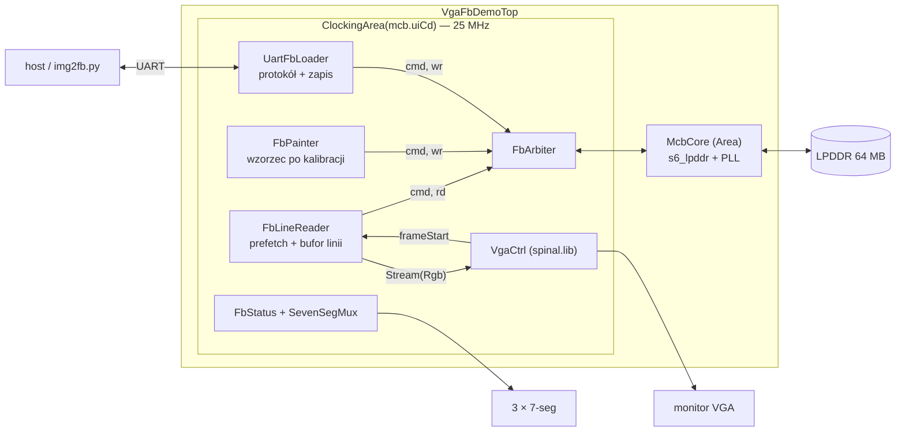

# Demo: VGA + framebuffer w LPDDR + wgrywanie obrazu przez UART

Mimas V2, SpinalHDL, na wierzchu kontrolera MCB z projektu `newhope.mcb`.
Obraz siedzi w LPDDR, `VgaCtrl` ze `spinal.lib` go wyświetla, host wgrywa nowy
przez UART, trzy cyfry pokazują status.

---

## 1. Jedna liczba, na której stoi cały projekt

**Zegar UI z MCB przy memclk 100 MHz to 25,000 MHz. Zegar piksela 640×480@60 to
25,175 MHz.** Różnica 0,7% daje 59,52 Hz zamiast 60,00 Hz — poniżej progu, przy
którym jakikolwiek monitor marudzi.

Konsekwencje, wszystkie dobre:

* cały projekt siedzi w **jednej domenie zegarowej** oddanej przez MCB — zero
  CDC na ścieżce pikseli, zero drugiego PLL-a, zero nowych `TIMESPEC`,
* `ClockingArea(mcb.uiCd)` wystarcza; `c3_sys_clk` dalej nie taktuje ani jednego
  rejestru projektu,
* odświeżanie obrazu można sprawdzić licznikiem na 7-seg: musi wyjść **59**.

Cena: **demo musi chodzić na memclk 100 MHz.** Podniesienie do 166 MHz (gdzie
zmierzyliśmy 643,8 MB/s) przesuwa zegar UI na 41,67 MHz i psuje VGA. To jedyny
punkt, w którym to demo nie dziedziczy wyników z projektu kontrolera.

---

## 2. Co trzeba mieć obok

Z projektu kontrolera MCB — bez zmian:

| Plik | Po co |
|---|---|
| `MigPort.scala` | `MigConfig`, `MigInstr`, `MigCmd`, `MigWrData`, `MigPort` |
| `S6Lpddr.scala` | BlackBox core'a, `uiClockDomain`, `p0(cd)` |
| `McbCore.scala` | `MigDramPins` + okablowanie (masz w projekcie) |
| `SevenSegMux.scala` | multiplekser 3 × 7-seg (masz w projekcie) |
| dziewięć plików `.v` z `user_design/` | patrz §3 README kontrolera |

Czyli tak — **`McbCore.scala` sam nie wystarczy**, ciągnie za sobą `MigPort`
i `S6Lpddr`. `MigBurstEngine`, `MigStatusDisplay` i `McbDemoTop` nie są
potrzebne.

Po stronie MIG-a: core wygenerowany jako **port 128-bitowy (Config-5), memclk
100 MHz**. Przy 100 MHz **nie trzeba ręcznie poprawiać dzielników PLL** (§5.3
tamtego README), bo domyślne `MULT = 4 / DIVCLK = 1` dają dokładnie
`INCLK = MEMCLK = 100 MHz`. Ten jeden raz MIG zgaduje dobrze.

---

## 3. Architektura



### Pliki

| Plik | Rola |
|---|---|
| `VgaFbConfig.scala` | wszystkie liczby + `require`-y + czasowanie VGA |
| `FbBus.scala` | magistrala wewnętrzna, arbiter, **jedyny** adapter do `MigPort` |
| `FbLineReader.scala` | prefetch linii, bufor ping-pong, strumień pikseli |
| `FbPainter.scala` | wzorzec kontrolny malowany raz po kalibracji |
| `UartFbLoader.scala` | protokół ramkowy → zapisy do LPDDR |
| `FbStatus.scala` | liczniki BCD, FPS, kilobajty, kody błędów |
| `VgaFbDemoTop.scala` | top + generowanie |
| `tools/img2fb.py` | konwersja obrazów i wgrywanie |
| `ucf/mimas_v2_vgafb.ucf` | UCF z jedną zmianą (§7.1) |

### Budżet przepustowości

| | 320×240 (`scale = 2`) | 640×480 (`scale = 1`) |
|---|---|---|
| framebuffer | 75 KiB (120 KiB ze stride) | 300 KiB (480 KiB) |
| odczyt na obraz | 4,6 MB/s | 18,3 MB/s |
| udział portu 128 b | **1,1%** | **4,6%** |
| wgranie przy 115200 bd | ~6,9 s | ~27 s |

Port jest wykorzystany w kilku procentach — wąskim gardłem tego demo jest UART,
nie pamięć. Dlatego zapisy z hosta idą **po jednym słowie na komendę**: przy
11 KB/s narzut jest niemierzalny, a warunek „dane przed komendą" spełnia się
trywialnie.

---

## 4. Budowa

```bash
sbt "runMain newhope.vgademo.VgaFbDemoTopVerilog"        # 320x240, 115200 bd
sbt "runMain newhope.vgademo.VgaFbDemoTopVerilog full"   # 640x480
```

Elaboracja wypisuje cały budżet — zegar, odświeżanie, stride, faktyczną
prędkość UART i czas wgrania klatki. To jest miejsce, w którym wychodzi
niezgodność między `MigConfig` a tym, co naprawdę wygenerował MIG.

W ISE: dziewięć plików `.v` MIG-a + wygenerowany `VgaFbDemoTop.v` +
`ucf/mimas_v2_vgafb.ucf`. Żadnych nowych ograniczeń czasowych nie trzeba —
cała nowa logika jest w domenie `c3_clk0`, dla której ISE wyprowadza
ograniczenie z `TS_SYS_CLK3`. Wyjścia VGA i UART są nieograniczone czasowo
świadomie: drabinka rezystorowa przy 25 MHz nie ma jak spóźnić się na tyle,
żeby to miało znaczenie.

---

## 5. Protokół UART

```
A5 5A 01 addr[4 LE] len[4 LE] <len bajtów> crc     zapis do pamięci
A5 5A 02 bufor                                     pokaż bufor 0 albo 1
A5 5A 03                                           ping
```

Odpowiedź to jeden bajt: `'K'` albo `'E'`. `crc` to XOR bajtów danych.
`addr` i `len` muszą być wielokrotnościami 16 (szerokość portu 128 b).

Trzy rzeczy, które ten bajt odpowiedzi załatwia naraz: kontrolę przepływu
(host nie wyśle kolejnego pakietu, zanim nie dostanie `'K'`), potwierdzenie
zapisu (MCB nie potwierdza zapisów — `'K'` leci dopiero po tym, jak ostatnia
komenda `WRITE` opuściła kolejkę) i wykrycie rozjechanego bauda (wtedy
przychodzi śmieć zamiast `K`, a nie cicho przekręcony obraz).

Bufory: `0x000000` i `0x100000`. Zamiana bufora dzieje się na `frameStart`, nie
natychmiast — inaczej zobaczyłbyś pół starego i pół nowego obrazu.

### Skrypt

```bash
./tools/img2fb.py send kot.jpg --port /dev/ttyUSB1          # wgraj i pokaż
./tools/img2fb.py send kot.jpg --port COM3 --buffer 0       # do drugiego bufora
./tools/img2fb.py convert kot.jpg -o kot.fb --preview p.png # tylko plik
./tools/img2fb.py pattern --port /dev/ttyUSB1               # wzorzec z hosta
./tools/img2fb.py ping --port /dev/ttyUSB1                  # sprawdź łącze
```

Skaluje z zachowaniem proporcji, kwantuje do RGB332 z **ditheringiem Bayera
8×8** (bez niego gradienty w 8 bitach koloru rozpadają się na pasy) i wysyła
wiersz po wierszu, **pomijając dopełnienie do stride** — przy 320 B linii
w odstępie 512 B to 37% czasu transmisji za darmo. `--preview` zapisuje PNG
z dokładnie tym, co zobaczysz na monitorze; warto raz porównać z `--no-dither`.

Plik `.fb` to surowy obraz pamięci ze stride — nadaje się wprost do zapisu
z dowolnego innego źródła.

---

## 6. Jak to jest zbudowane w środku

### Bufor linii i schemat kredytowy

`VgaCtrl` zabiera jeden piksel na takt przez całe 640 taktów i nie ma jak
czekać. MCB ma latencję zależną od trafienia w wiersz, odświeżania i innych
masterów. Między nimi stoi bufor jednej linii w BRAM, dwa banki, ping-pong.

Zamiast liczyć „czy zdążę", `FbLineReader` trzyma licznik kredytów — ile banków
jest wolnych do wypełnienia:

```
frameStart        -> kredyt = 2      (vblank, oba banki wolne)
koniec linii fb   -> kredyt + 1      (bank właśnie się zwolnił)
start pobierania  -> kredyt - 1
```

Kredyt nigdy nie przekracza 2, więc nadpisanie wyświetlanego banku jest
**niemożliwe konstrukcyjnie**, a nie przez dobranie opóźnień. Zapas czasu:
pobranie linii to ~30 taktów przy 800 taktach linii ekranu.

Pozycja na ekranie liczona jest z `io.pixels.fire`, a nie z własnego licznika
taktów. Dzięki temu licznik `x`/`y` nie może rozjechać się z tym, co `VgaCtrl`
faktycznie wyświetla — a taki rozjazd byłby dokładnie tym błędem, którego nie
widać na oscyloskopie.

### Arbitraż na jednym porcie

Port 128-bitowy to Config-5, czyli **jeden port dwukierunkowy**. Nie ma opcji
„odczyt dostanie własny port", i tak by nie pomogła (§6 README kontrolera:
więcej portów nie daje przepustowości).

Priorytet: odświeżanie > malowanie > host. Bezpieczeństwo kolejności bierze się
z tego, że **czyta tylko jeden master**, więc nie ma komu pomylić właściciela
danych wracających bez tagu. Kanał zapisu jest ostrzejszy: dane w FIFO nie mają
tagu, więc dwóch piszących nie może nadawać naraz — painter i host wykluczają
się konstrukcyjnie (`loader.enable = calib && !painter.busy`).

### Wzorzec testowy w FPGA

Po kalibracji `FbPainter` maluje ramkę, przekątne i szachownicę ośmiu kolorów.
Bez tego pierwszy widok po włączeniu to zawartość niezainicjowanego DRAM-u,
czyli śnieg — a śnieg wygląda identycznie jak zła kolejność bajtów, zły stride,
niedziałający prefetch i pomylone piny drabinki. Wzorzec **rozdziela debug toru
wyświetlania od debugu UART-a**: jeśli ramka i przekątne są proste i dochodzą do
rogów, to VGA, adresowanie i czytanie z LPDDR działają, a wszystko dalej to
wina hosta.

---

## 7. Pułapki

### 7.1 Niebieski ma dwa piny, ale numery [2] i [1]

UCF Numato nazywa drabinkę niebieskiego `Blue[2]` i `Blue[1]`, zostawiając
dziurę po `Blue[0]`. `Rgb(3,3,2)` ma pole `b` szerokie na dwa bity, czyli port
`Blue[1:0]`. To jedyna zmiana w UCF-ie — piny zostają te same, A11 dalej jest
bitem starszym. Gotowy plik: `ucf/mimas_v2_vgafb.ucf`.

### 7.2 `VgaCtrl` nie zeruje koloru poza obszarem widocznym

Podaje wprost payload strumienia, również w czasie wygaszania. Bez maskowania
przez `colorEn` monitor dostaje „piedestał" i albo gubi synchronizację, albo
pokazuje sprany obraz. Maska jest w topie, w jednym miejscu, tuż przed pinami.

### 7.3 `VgaTimingsHV` ma pięć pól, nie cztery

Oprócz czterech progów jest jeszcze `polarity`, a `VgaCtrl` robi z niego
`io.vga.hSync := h.sync ^ h.polarity`. Jest to zwykłe wejście komponentu, więc
niezasterowane kończy elaborację na `NO DRIVER ON io_timings_h_polarity`
(i to samo dla osi pionowej — stąd dwa błędy naraz, bo oś się dubluje).

Wartość: `false`. Rejestr `sync` wewnątrz `VgaCtrl` jest niski dokładnie przez
czas trwania impulsu, więc `polarity = false` daje impuls **aktywny niskim**,
czyli to, czego chce 640×480@60. Pole `activeHigh` w `VgaAxisTiming` jest na
tryby w rodzaju 800×600, gdzie VESA chce obu impulsów dodatnich.

Przeliczenie `(visible, front, sync, back)` na progi siedzi w
`VgaFbConfig.applyTimings`; nie przepisuj go z palca w topie.

### 7.3a `UartCtrl.io.read` to `Stream`, nie `Flow`

Ma `ready` i jest ono wejściem kontrolera — bez zasterowania dostajesz trzeci
`NO DRIVER`. `UartFbLoader` trzyma je stale wysoko, czyli świadomie sprowadza
strumień do `Flow`: automat obsługuje każdy bajt w jednym takcie, a przy
115200 bd i zegarze 25 MHz między bajtami jest ~2170 taktów zapasu. Gdyby to
założenie kiedyś padło, łapie to `flowErr` i odpowiedź `'E'` — nie ginie po cichu.

Efekt uboczny, który jest tu zamierzony: bajty przychodzące przed kalibracją są
odbierane i wyrzucane, a nie trzymane w kontrolerze. Inaczej pierwszy bajt po
włączeniu byłby śmieciem sprzed kalibracji.

### 7.7 UART na Mimasie V2 chodzi 19200 i nie da się inaczej

Mostek USB–UART na tej płytce to mikrokontroler PIC, nie FTDI. Fabryczny
firmware obsługuje stronę FPGA **wyłącznie przy 19200 bd** — to nie jest
ustawienie po stronie PC, tylko sztywna liczba w firmware. Dlatego domyślne
`uartBaud` to 19200, a nie 115200.

Konsekwencja: 75 KiB przy `scale = 2` to około **40 sekund** na obrazek, a przy
`scale = 1` (480 KiB) grubo ponad cztery minuty. Jeśli to przeszkadza, jest
alternatywny firmware PIC-a (projekt `jimmo/numato-mimasv2-pic-firmware` i jego
pochodne), który daje 115200 i zgłasza **dwa** porty szeregowe naraz —
programator i UART FPGA — więc przełącznik SW7 przestaje być potrzebny. Wtedy
buduj z jawnym argumentem: `sbt "runMain newhope.vgademo.VgaFbDemoTopVerilog 115200"`.

**Port znika po przestawieniu SW7.** To normalne przy fabrycznym firmwarze:
PIC wystawia jedno urządzenie USB i przy zmianie trybu enumeruje się od nowa.
Po przełożeniu przełącznika przepnij kabel USB i poczekaj — port wróci, ale
w Windows może dostać **inny numer COM** niż ten od programatora. W trybie UART
nie da się programować płytki i odwrotnie, więc cykl jest taki: SW7 w pozycji 1,
wgranie bitstreamu, SW7 w pozycji 2, przepięcie kabla, dopiero wtedy `img2fb.py`.

### 7.4 Przy 25 MHz nie każda prędkość UART jest osiągalna

`UartCtrl` próbkuje 8× na bit, więc zegar próbkowania to 3,125 MHz i dostępne
są tylko `3,125 MHz / N`. Dla 115200 wychodzi N = 27 → 115740 bd, błąd +0,47%,
całkowicie bezpieczny. Ale 500000 bd dałoby N = 6 → 520833 bd, czyli **+4,2%**
i pewne przekłamania. `VgaFbConfig` liczy ten błąd przy elaboracji i **przerywa
build powyżej 1,5%** — nie dowiesz się o tym dopiero przy przekręconym obrazku.

Jeśli kiedyś potrzebny będzie szybszy transfer, są trzy wyjścia i żadne nie jest
za darmo: mniejsze próbkowanie (`samplingSize`, ale to zmiana generyków i
odporności na jitter), UART w domenie 100 MHz (CDC + nowe ograniczenia
czasowe), albo kompresja po stronie hosta (RLE dla grafiki płaskiej daje
zwykle 3–10×).

### 7.5 Dane przed komendą, tu w dwóch smakach

Painter pcha całą linię (20 słów, FIFO ma 64) i dopiero potem wystawia jedną
komendę `WRITE` na całą linię. Host pcha jedno słowo i jedną komendę `bl = 0`.
Oba warianty spełniają warunek z §6 README kontrolera bez żadnego liczenia
`wr_count` — którego i tak nie wolno używać do zapobiegania underrunowi.

### 7.6a Żaden master nie może ruszyć portu przed kalibracją

Komenda `READ` wystawiona przed `calib_done` nie zwraca danych i **nie zapala
żadnej flagi błędu MCB** — z punktu widzenia kontrolera nic złego się nie stało.
Automat pobierania zawiesza się wtedy w `sData` z podniesionym `rd.ready`,
`bankReady` nigdy się nie ustawia i strumień pikseli jest martwy na zawsze.

Objaw jest mylący, bo wygląda na problem z wyświetlaniem: **czarny ekran,
licznik FPS pokazuje 60, `calib_done` świeci, `mcb_fault` ciemna, `data_error`
świeci.** Dlatego `FbLineReader` ma wejście `enable`, a top podaje na nie
`calib`. Painter i loader były bramkowane od początku; czytnik nie — i to
kosztowało jeden build.

### 7.6b Kolejność zapisu kodu decyduje o wartości sygnału kombinacyjnego

SpinalHDL czyta sygnał kombinacyjny w takiej wartości, jaką miał **w tym
miejscu kodu**, a nie w wartości końcowej. Blok aktualizujący kredyt czyta
`start`, które wystawia automat, więc musi stać **za** automatem. Postawiony
przed nim kompiluje się bez słowa ostrzeżenia, tylko `start` jest tam zawsze
fałszem, kredyt nigdy nie maleje i ochrona przed nadpisaniem wyświetlanego
banku istnieje wyłącznie w komentarzu.

### 7.6 `frameStart` łapany w zatrzask

Gdyby `FbLineReader` reagował na `frameStart` natychmiast, impuls w środku
burstu przestawiłby bank pod lecącymi danymi. Resynchronizacja czeka na stan
`sIdle` — w vblank jest na to 35 linii, czyli 28 000 taktów.

---

## 8. Diagnostyka

| Wyświetlacz | Znaczenie |
|---|---|
| `- - -` | przed kalibracją MCB |
| `E E n` | błąd MCB: 1 `wr_underrun`, 2 `wr_error`, 3 `rd_overflow`, 4 `rd_error` |
| liczba **z kropkami** | kilobajty odebrane przez UART (trzyma się sekundę po transferze) |
| liczba **bez kropek** | klatki na sekundę na wyjściu VGA — **musi być 59** |

Kropka jako znacznik trybu, nie prefiks — tak samo jak w projekcie kontrolera.

| Dioda | Znaczenie |
|---|---|
| `calib_done` | kalibracja MCB |
| `test_done` | przyjęto co najmniej jeden pakiet |
| `test_error` | błąd protokołu albo CRC (zatrzaskiwany) |
| `data_error` | niedobieg pikseli — bufor linii nie zdążył (zatrzaskiwany, liczony dopiero po kalibracji) |
| `mcb_fault` | którykolwiek błąd portu MCB (zatrzaskiwany) |

Przy czarnym ekranie kombinacja diod wskazuje stronę, po której szukać. Zakłada
to, że diody Mimasa świecą stanem wysokim — jeśli `calib_done` jest ciemna mimo
lecącego licznika FPS, czytaj całą tabelę na odwrót.

| Świecą | Co to znaczy |
|---|---|
| tylko `calib_done` | tor wyświetlania działa, pamięć oddaje same zera — zapisy paintera nie trafiły tam, gdzie czyta czytnik |
| `calib_done` + `data_error` | czytnik nie dostarcza pikseli: pobieranie zawieszone albo nie nadąża |
| `calib_done` + `mcb_fault` | kod błędu na 7-seg wskazuje winowajcę: 3 to czytnik, 1 to painter |
| `calib_done` ciemna, FPS = 0 | kalibracja nie przeszła — sprawa jest w MCB, nie w tym demo |

Licznik FPS jest wiarygodny jako pierwszy krok, bo `VgaCtrl` trzyma liczniki
w zerze póki trwa `softReset`, a ten jest zdjęty dopiero przez `calib`. Klatki
lecą więc tylko wtedy, gdy kalibracja przeszła i generator czasowania chodzi.

Kolejność bring-upu, która oszczędza czas: **FPS = 59 i wzorzec na ekranie**
zamykają temat VGA + LPDDR bez podłączania hosta. Dopiero potem `ping`, potem
`pattern --port ...` (ten sam wzorzec, ale liczony na hoście — różnica wskazuje
na protokół), potem prawdziwy obrazek.

---

## 9. Wątki otwarte

**Zasoby nie są zmierzone.** Szacunek: bufor linii to 5 Kb, czyli jeden BRAM18;
logika trzech masterów plus status to kilkaset LUT-ów obok 454 już zajętych
przez MCB. Na LX9 to powinno wejść z dużym zapasem, ale to szacunek, nie raport
— pierwszy build zweryfikuje.

**Ścieżka krytyczna przez mux bajtu.** Wybór bajtu z 128-bitowego słowa jest
kombinacyjny od wyjścia BRAM-u aż do pinu. Przy 40 ns budżetu to nie ma prawa
przeszkadzać, ale gdyby raport pokazał coś innego, rejestr za muksem kosztuje
jeden takt opóźnienia i wymaga przesunięcia `byteSel` o takt.

**`scale = 1` nie jest sprawdzone pomiarowo.** Kod jest sparametryzowany, ale
przy 640×480 pobieranie linii to dwa bursty zamiast jednego, a zapas czasu
spada z dwóch linii ekranu do jednej. Wciąż ~25× zapasu, ale to inna ścieżka
w automacie.

**Tearing przy zapisie do wyświetlanego bufora.** Host może pisać gdzie chce,
łącznie z buforem aktualnie na ekranie. Podwójne buforowanie to rozwiązuje
tylko wtedy, gdy się go użyje — skrypt domyślnie pisze do bufora 1, ale nic nie
broni wpisać `--buffer 0` zaraz po starcie i zobaczyć przesuwający się szew.

**Scroll i sprite'y za darmo.** `reader.io.base` jest rejestrem, a nie stałą.
Przesuwanie go o `lineStride` daje przewijanie pionowe bez kopiowania jednego
bajtu, a o 16 — poziome ze skokiem 16 pikseli. Przy 1,1% wykorzystania portu
jest miejsce na drugą warstwę czytaną równolegle.
